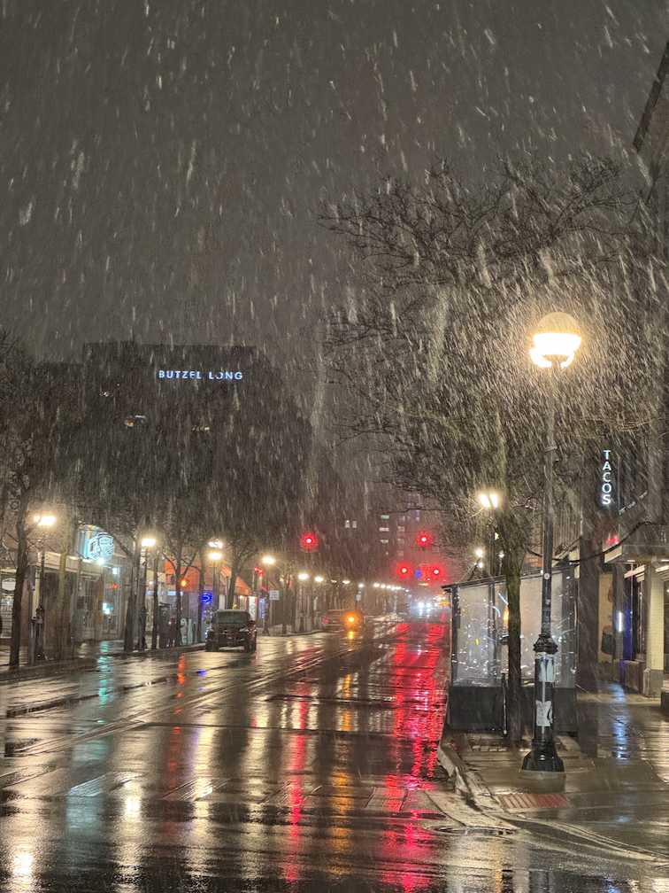
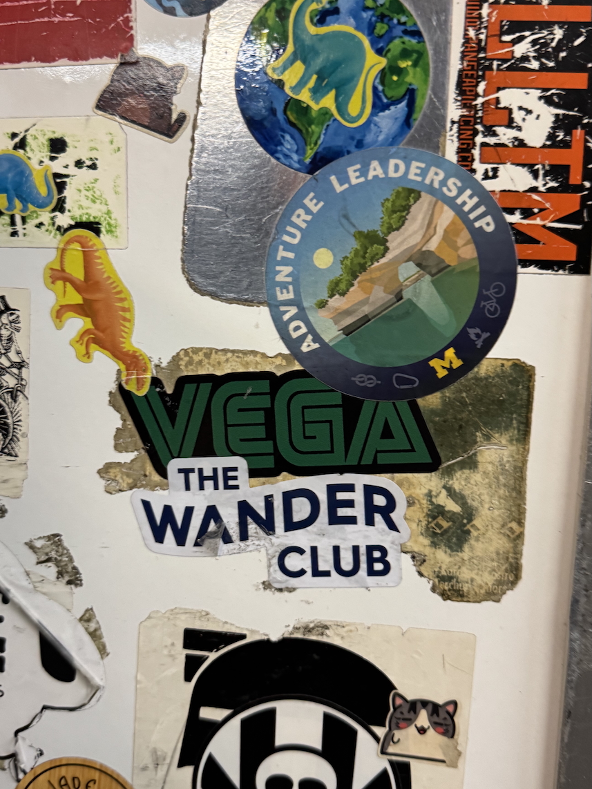

    <figure>
        
    </figure>
    <figure>
        
    </figure>

Hello! It is a beautiful day here in Ann Arbor, MI -- 67°F, mostly sunny, gentle breeze. To think it was snowing just last Wednesday -- perhaps I can finally put my parka away for the year! („ᵕᴗᵕ„)

### In research news:
I am happy to announce that **AI Attitudes Among Marginalized Populations: Nonbinary, Transgender, and Disabled Individuals Report Higher AI Hesitancy** (led by <a href="https://oliverhaimson.com" target="blank"><b>Oliver L. Haimson</b></a>, co-authored by myself, <a href="https://www.alexisshoreingber.com" target="blank"><b>Alexis Shore Ingber</a></b>, and <a href="https://www.nazaninandalibi.net" target="blank"><b>Nazanin Andalibi</a></b>) has been accepted to the ACM Conference on Fairness, Accountability, and Transparency (ACM FAccT) 2025! 

I would also like to congratulate fellow CRIT Lab member <a href="https://francescalameiro.com" target="blank"><b>Francesca Lameiro</a></b>, whose first first-authored paper -- **TIDEs: A Transgender and Nonbinary Community-Labeled Dataset and Model for Transphobia Identification in Digital Environments** -- was also just accepted to ACM FAccT 2025! 

Will update this post with more details on the FAccT 2025 acceptances (and links to papers) once available (˶ˆᗜˆ˵)

### In PhD news:
I gave my first-ever guest lecture a few weeks ago! The guest lecture was for SI 315, and focused on how social media users develop folk theories about unclear/opaque algorithmic systems. I spoke a little about my own paper (on marginalized social media users' <a href="https://dl.acm.org/doi/epdf/10.1145/3632741" target="blank">content moderation folk theories</a>) during the lecture -- it felt surreal speaking to a class full of students who all read my paper. They read my paper! They asked questions about it! ...Wow! Wowowowowowowow!! 

* **Algorithms, AI, and Social Media**    
Guest lecture for Interpersonal & Psychological Implications of Social Media (School of Information 315)   
University of Michigan  
March 25th, 2025  

I also participated in a guest talk for SI 429 with fellow CRIT Lab member/co-author/roomstie <a href="https://www.hibbythach.com" target="_blank"><b>Hibby Thach</b></a>. Our conversation focused more on the students' questions related to marginalized social media users' experiences with online content moderation systems (some students also asked us questions about navigating grad school!). Chatting with Hibby and the students was great, I really enjoyed the discussion format :-]

* **Regulation and Moderation of Online Communities**  
Guest talk with <a href="https://www.hibbythach.com" target="_blank"><b>Hibby Thach</b></a> for Online Communities (School of Information 429)  
University of Michigan  
April 2025  

These were my first-ever guest lecture/talk experiences, so I felt a little nervous at first -- but they both went quite well, I'm very thankful! (੭˃ᴗ˂)੭ 

### In personal news:
It's been an interesting few weeks! I thankfully found time for fun -- met <a href="https://www.instagram.com/plasmanyc/?hl=en" target="blank"><b>Plasma</a></b> from RuPaul season 16 at Uplift Ann Arbor (I appreciate her support for U-M students after the DEI shutdown!), and also attended my friend <a href="https://andrewnosay.com" target="blank"><b>Andrew Nosay's</a></b> art show at Eastern Michigan University. Also did plenty of work/life stuff -- drove around town with my roommate to look for apartments (scheduled a few unit tours!), attended Oliver L. Haimson's <a href="https://mitpress.mit.edu/9780262551861/trans-technologies/" target="blank"><b>Trans Technologies</a></b> book talks (so happy to see this book out in the world!), and also helped run an app feedback workshop with other members of the CRIT Lab... whew, what a list! No wonder I've been so tired lately -- I be sure to rest before flying to Yokohama next week (⸝⸝ᴗ⩊ᴗ⸝⸝) ᶻ 𝗓 𐰁