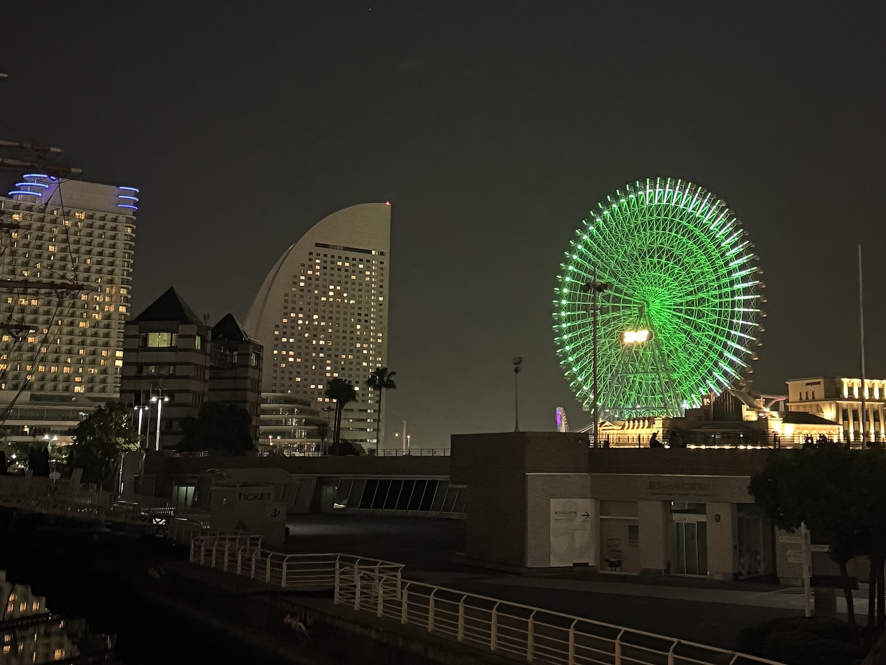
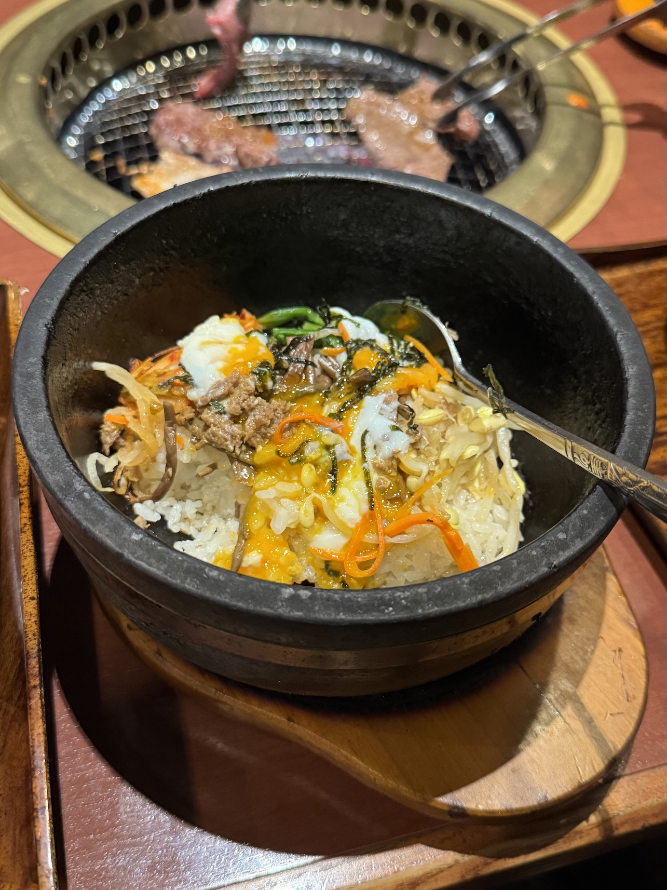
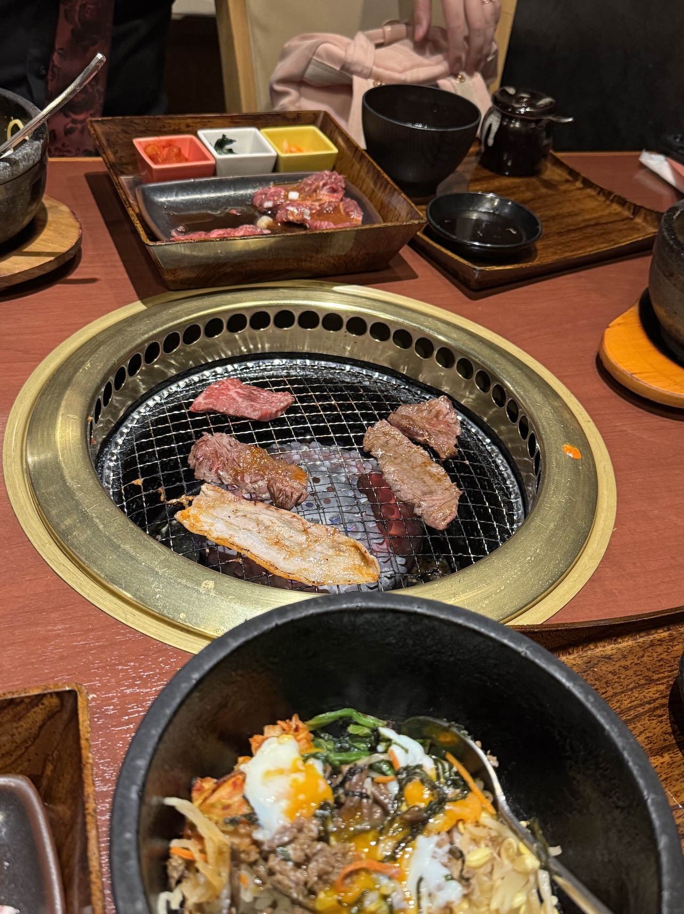
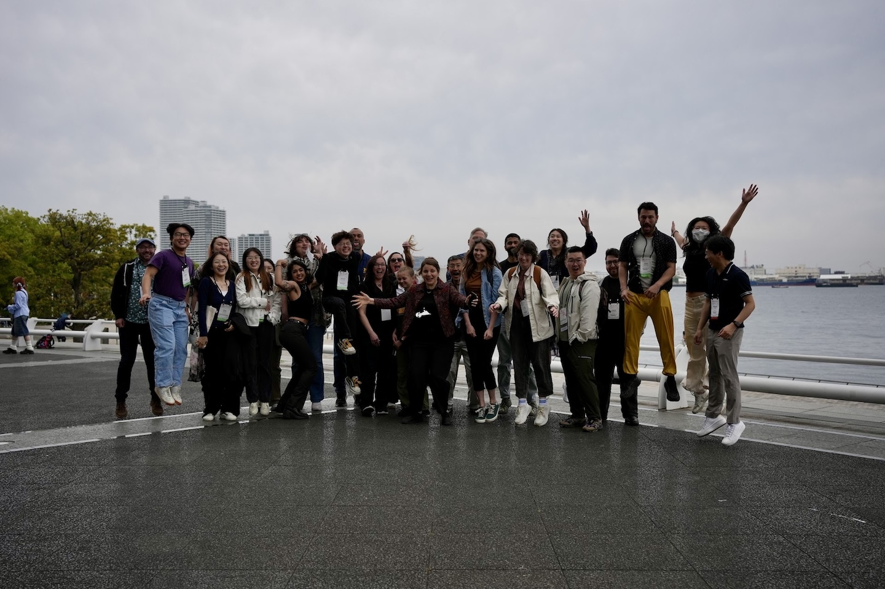
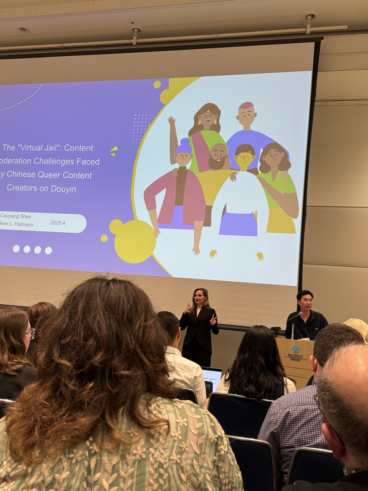
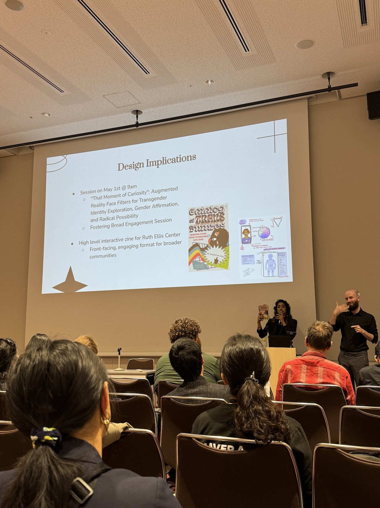

Greetings from Yokohama! I left the United States from DTW last Thursday; one 14 hour direct flight and several train rides later, I dropped my things off at the hotel, ate katsudon from a nearby 7-Eleven, then got some deeply-needed sleep (｡- ᴗ - ｡) ᶻzᶻzᶻz﹒﹒

### 26 April (Saturday)
My colleague Hibby Thach and I wandered over to Yokohama Pacifico North to pick up our CHI badges on Friday. I can see Cosmo Clock 21 (one of the world's tallest ferris wheels!) in the distance as I walk from my hotel to the convention center -- what a lovely view! 🎡

    

I didn't have any workshops to attend on Sunday, so I spent a little time walking around Minato Mirai before hopping on a train and heading up to Shinjuku for the afternoon! Despite being born in Japan, livng in Japan (including Yokohama!) for years, and half family living in Japan, I've hardly spent any time in Tokyo (and never by myself!). It was nice to walk around and explore on my own terms (˶◜ᵕ◝˶)

After I returned to Yokohama, my advisor and I chatted about how neither of us have had time to eat at a restaurant yet, and have only picked up meals from 7-Eleven, Family Mart, and other *konbini.* I can't complain though, *konbini* food is great -- imagine if American 7-Eleven food was like that! (๑ᵔ⤙ᵔ๑) 𓌉◯𓇋

### 27 April (Sunday)
I attended the Resisting AI Solutionism workshop session today! Lots of excellent conversations about AI bias/harms and about rejecting "inevitability" narratives. It's funny, the AI boom hadn't started yet when I began researching algorithmic content moderation/folk theorization about algorithmic content moderation/etc in 2021. Now it's 2025 and I can't escape the topic no matter what I study! ( 𖦹‸𖦹)

    <figure>
        
    </figure>
    <figure>
        
    </figure>

Some of us also got lunch at Kangen, a yakiniku/Korean place in Minato Mirai -- so good, and surprisingly affordable! We had a nice chat about digital accessibility in rural/remote communities, especially related to K-12 education. This conversation made me think back to being a youth services librarian during the lockdowns, knowing many of my K-12 patrons had no internet access at home, and had to use public Wi-Fi to attend their Zoom classes -- some did so at our town's public library, and others did so at the local McDonalds! ...Augh. A difficult time to dwell on.

### 28 April (Monday)
Happy Day 1 of CHI 2025! I got used to Saturday and Sunday's easygoing vibe, where the only people around were workshop attendees. I was shocked by how many people attended the opening plenary -- I've never been to such a large conference before! I wonder how many people I'll meet in the coming days? (｡·  v  ·｡) ?

The UMSI students/faculty CHI attendees took group photos after the plenary -- it was quite windy out there, but I think my hair looked alright! (Photo credits to Noor Hindi and Kevin Zheng -- thank you both for all the wonderful photos!)

    

Two CRIT Lab students presented their work at CHI 2025 today (bolded names are presenters):
- <a href="https://deepblue.lib.umich.edu/handle/2027.42/196552" target="_blank"><b><i>The Virtual Jail: Content Moderation Challenges Faced by Chinese Queer Content Creators on Douyin</i></b></a>, authored by **Caoyang Shen** and Oliver L. Haimson  
- <a href="https://deepblue.lib.umich.edu/handle/2027.42/196549" target="_blank"><b><i>Cataloging Augmented, Ambivalent Transgender Futures: Designing Inclusive AR Technologies for Trans Communities Through Speculative, Participatory Zine-Making</i></b></a>, authored by **F. R. Khan**, Kat Brewster, Aloe DeGuia, Denny L. Starks, Malaya Mañacop, Samuel Mayworm, Tawanna R. Dillahunt, and Oliver L. Haimson  

    <figure>
        
    </figure>
    <figure>
        
    </figure>

I also attended this year's CHI Queers meetup in the evening (I walked through the rain to get to the venue -- thank goodness for my umbrella!). I thought about how nice it can feel to be in an explicitly queer space like that (both in general and in These Trying Times™), laughing, learning, taking comfort in one another's presence. Picture if you will: you're in a comfy Americana-themed restaurant in a small Yokohama side-street, making conversation over *shochu* with new friends while enjoying the nighttime rain outside the window. What a nice memory ( ˶ˆ꒳ˆ˵ )

---
I will continue writing about CHI 2025 in a later blog post -- I hope the rest of the conference goes well! 