Greetings from... Ann Arbor! I returned from Yokohama to Ann Arbor late last week; after spending the weekend trudging through jet lag, I am now back to work as usual. Here is a recap of the second half of my CHI 2025 experience: 

### 29 April (Tuesday)
**Day 2 of CHI 2025:** Today was a little more subdued than the past few days; no big Tokyo trips or queer get-togethers this time, just a day spent conference-ing (with a few detours!). 

After attending a morning paper session, I stood in line for an hour to grab a commemorative CHI 2025 *maneki-neko* plushie! I was lucky enough to get in line early and buy a plushie before the all sold out... they were incredibly popular! ₍^. .^₎⟆

    <a href="../images/manekineko-2025.jpg" data-caption="CHI 2025 Manekineko plushie!">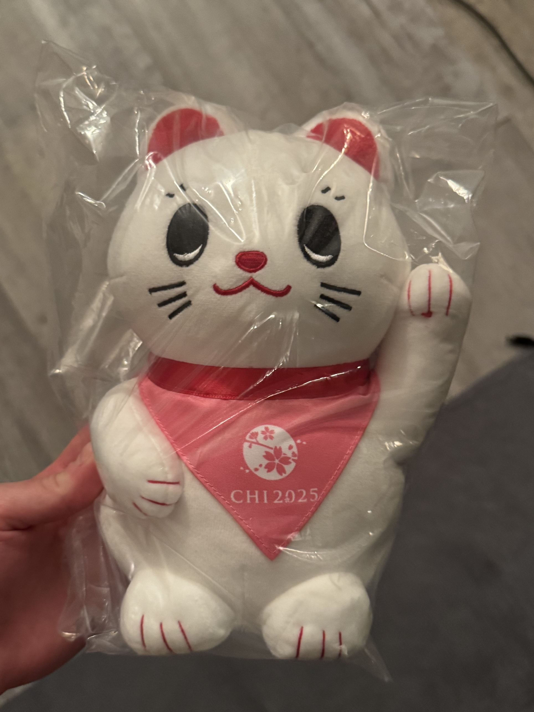</a>

Later, my friend Kevin and I had *tonkatsu* for lunch; we talked a bit about conducting research in 2025, visiting our respective "motherlands," and making sure to have fun while we're here in Japan! Prioritizing "fun" can be difficult for me (I'm a bit of a "workaholic"), but I think Kevin's right: I only get so many chances to visit The Motherland™, so I might as well enjoy my time here. (´ ˘ `)

Later today, I had an awful realization: my eyesight was really, *really* bad! My prescription was at least two years out of date, and I really struggled throughout the day to see my friends' presentation slides. After attending a few more paper sessions, I snuck back to the Minato Mirai JINS location to complete an eye exam, update my prescription, and buy a new pair of glasses! Though I was nervous about completing an eye exam in Japanese, everything went completely fine. My replacement glasses are excellent, took only 40 minutes to make, and were much more affordable than most glasses in the USA (even with insurance!). The JINS detour was an excellent decision, it feels great to see again! ദ്ദി(⎚_⎚)

    

Later, a few friends and I got *yakiniku* for dinner in downtown Yokohama. It's funny, despite having lived in/near Yokohama for several years of my life, I'd never actually been downtown at night before this trip. It dawned on me why most of my memories of Japan were in the daytime: I was a child back then, so I was probably in bed by night time! "(っ- ‸ - ς)ᶻ 𝗓 𐰁

### 30 April (Wednesday)
**Day 3 of CHI 2025:** One problem I've had throughout this trip is very, very poor sleep. I only get around 5 hours of sleep most nights; there was little time for me to get past jet lag before the conference began, which really impacted me today. Do you ever lie there in bed just *begging* for your brain to fall back asleep, and it just... won't? Not fun! .·°՞(≧o≦)՞°·.

Grabbed breakfast at 7-Eleven (I think had konbini food for breakfast literally every day I was in Japan LOL), walked back to PACIFICO North for the conference, watched a presentation, then checked out the poster presentation with my friend (and our lab's postdoc) Kat Brewster. We talked a bit about food in Japan, and how many major Japanese rail hubs double as shopping malls (imagine if American transit hubs worked similarly!). We also talked about the sheer amount of AI-related sessions at CHI this year -- that's every tech conference these days, but still, sheesh! (𖦹﹏𖦹;)

    <a href="../images/pacifico1-2025.jpg" data-caption="The north entrance to PACIFICO Yokohama, the CHI 2025 convention center (Yokohama, Japan)">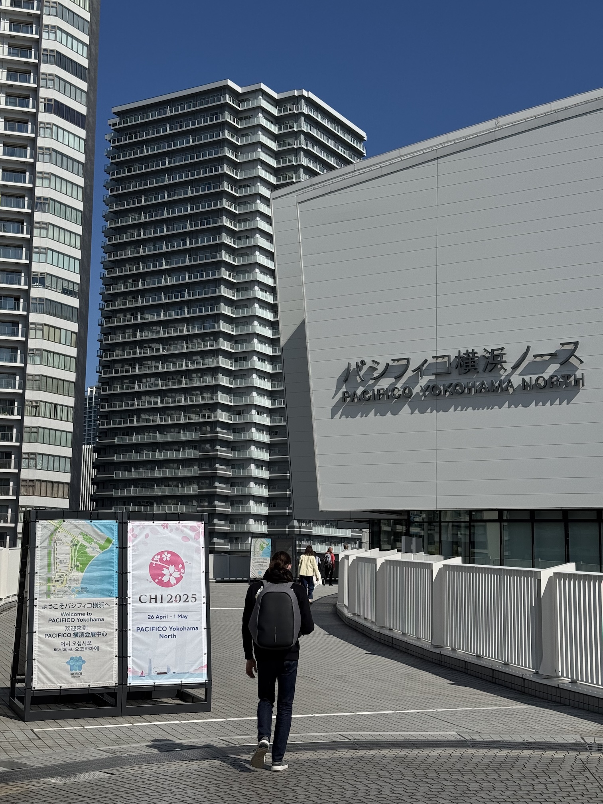</a>

The lgbTq SIG took place later in the morning; most conversation focused on the current wave of anti-trans executive orders and political activity in the United States (including the cancellations of trans-related research grants), and how to conduct trans-related research in such conditions. It felt really nice talking to other queer and trans researchers who have suffered similarly under these conditions, not unlike how I felt at the CHI Queers get-together a few nights prior. It helps to not feel alone, doesn't it? ( ⸝⸝´꒳`⸝⸝)

Took the train to the Yokohama Pokemon Center after today's conference activities wrapped up -- it was really nice!. Though I had visited a Pokemon Center in Tokyo before, this was my first time visiting the one in Yokohama. Bought a few plushies and figurines as gifts for friends (and a few plushies for myself, had to grab that West Side Gastrodon lol). The cashier asked me whether I was learning Japanese in school; when I explained to her that I lived in Japan as a child before immigrating, she laughed and said that my Japanese is quite good! I appreciated her kind words -- I sometimes feel very insecure about my so-so Japanese skills, and feel relieved that I can speak well enough to get by (as a visitor, anyways).

    <figure>
        
    </figure>
    <figure>
        <a href="../images/pokemon2-2025.jpg" data-caption="A Johto-themed Pokemon card deck at Pokemon Center Yokohama (Yokohama, Japan)">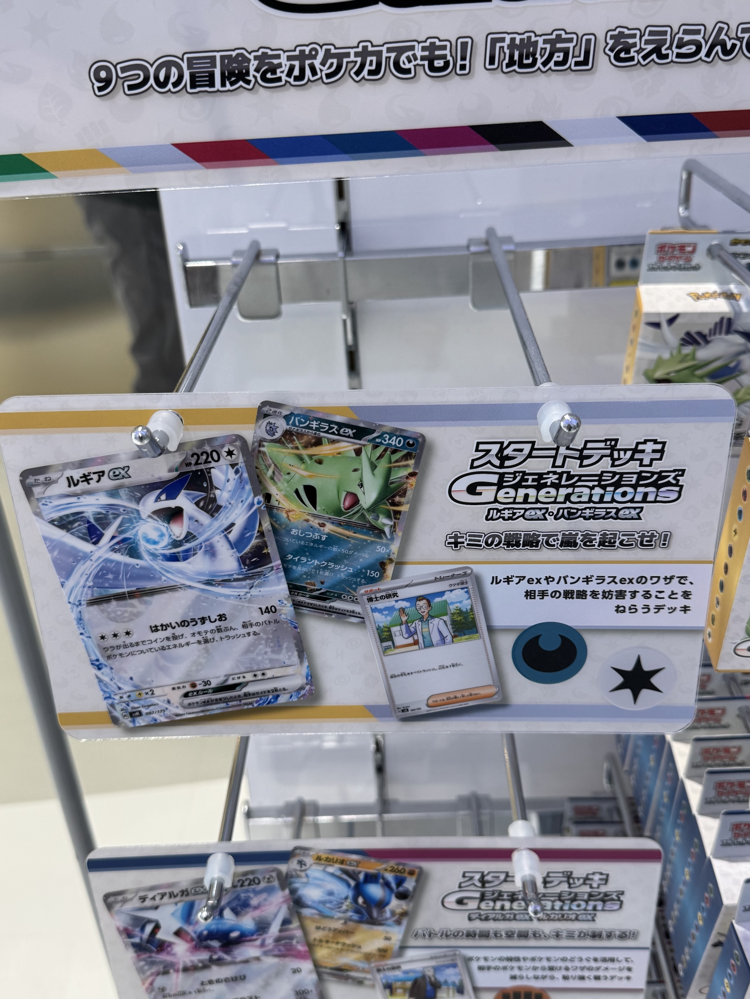</a>
    </figure>

I returned to downtown Yokohama at night to get *omakase* dinner with Hibby and several other friends. *Omakase* was also a new experience for me, and I deeply enjoyed it (even if the chef put *lots* of wasabi under some of those salmon slices)! Japanese *miso* soup sometimes includes lots of baby clams; whenever I see them, I think about those hot, humid July afternoons in Fukuoka where I'd go clam-digging with family on the beach. ...How long has it been since I've visited a beach? (⊙_⊙)

### 01 May (Thursday)
**Day 4 of CHI 2025:** Woke up and walked to the convention center feeling very glum about leaving Yokohama tomorrow. Last day of CHI 2025, last day in Japan... for me, anyways! My roommate, professor, and many friends would stay longer for personal vacation time -- despite the cost, I wish I'd chosen to stay longer too. 

Watched Kat Brewster's presentation on co-designing AR face filter technologies with trans people themselves -- they noted at the end of their presentation that our lab had to stop development of their AR face filter app prototype after the NSF grant funding the project was terminated. ...What a bleak, unfair, cruel, and senseless state of affairs. 

    <a href="../images/katchi-2025.jpg" data-caption="'That Moment of Curiosity': Augmented Reality Face Filters for Transgender Identity Exploration, Gender Affirmation, and Radical Possibility">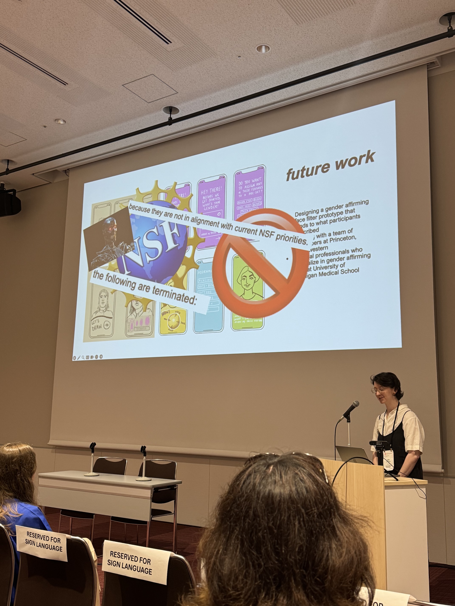</a>

I spoke with some friends and handed out some business cards before making my way to the closing plenary. The closing presentation was given by Masako Wakamiya; she spoke about learning to code in her 80s, creating art in Microsoft Excel based on traditional Japanese fabric patterns, and developing inclusive technologies for aging populations. What a beautiful presentation! I wonder if I'll still be thinking about technology at her age? („★o★„)

    <figure>
        <a href="../images/CHIclosing1-2025.jpg" data-caption="CHI 2025 Closing Plenary (Yokohama, Japan)">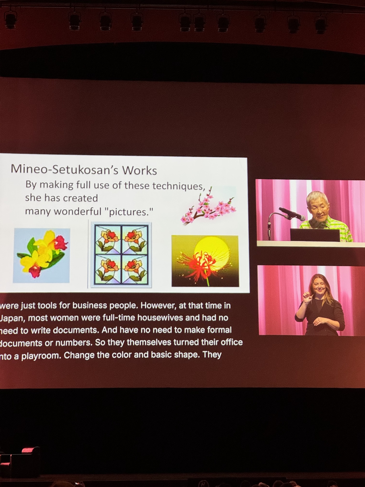</a>
    </figure>
    <figure>
        
    </figure>

A few closing words and acknowledgements later, CHI 2025 officially came to an end. I said "until next time!" to a few more conference-goers as we exited the convention center, and took some final photos of the Yokohama Bay Bridge outside the conference center windows. I'll miss seeing that bridge in the distance.

    <a href="../images/baybridge-2025.jpg" data-caption="The Yokohama Bay Bridge (Yokohama, Japan)">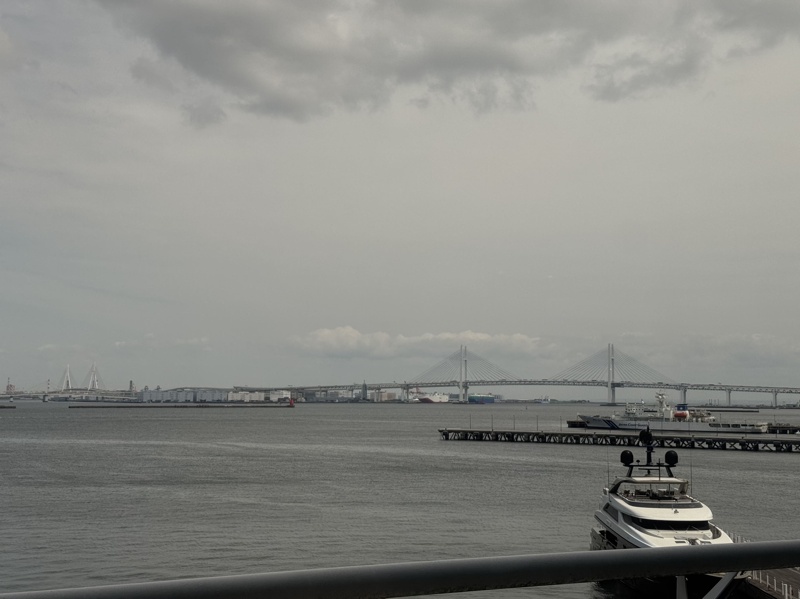</a>

I took one last look at the conference hall before walking to the train station and taking a ride to Shibuya, taking quite a few photos out the train window as we passed through Kawasaki and Ota. Some of Tokyo's special wards look more like my grandmother's hometown (a small rural mining village near Fukuoka) than places like Shibuya, Shinjuku, or Yokohama itself (though even these wards are much larger than where my grandmother lives). A sea of concrete apartment buildings, ordinary *apaato* and *tower mansions,* some *danchi* complexes too -- blocky, uniform, mostly built in the 60s through 80s, balconies with laundry hangers out in the sun. Narrow alleyways winding between houses and roads, lined with concrete walls streaked with dirt running down from the top. Grocery stores, *konbini,* and laundromats stand side-by-side just blocks away from ancient shrines and pagodas (well, "ancient" -- most were rebuilt after the war), all nestled between dense forests and mountains. Everything smells faintly of sulfer. ...I should visit my grandmother's hometown sometime.

    

After arriving in Shibuya, I met up with Kevin for a little thrift shopping -- if only I'd realized that it was Golden Week! Shibuya was absolutely packed with people, even more than usual. I had a great time thrifting there, found a nice shirt made from repurposed kimono cloth (I'd better make sure to keep it clean, I don't want to wash it too frequently!). Kevin also got a nice pair of white and orange shoes from Onitsuka Tiger; I may have to find some next time I'm in Japan, they seem quite comfortable!

Getting back to Shibuya Station that night was very challenging with all the crowds around, but also weirdly fun? I don't mind blending into a crowd from time to time; after feeling somewhat hyper-visible throughout my visit to Japan (I always feel that way when I go back), it felt nice to disappear for once. (—ᴗ—)

    <figure>
        <a href="../images/shibuya1-2025.jpg" data-caption="CHI 2025 Closing Plenary (Yokohama, Japan)">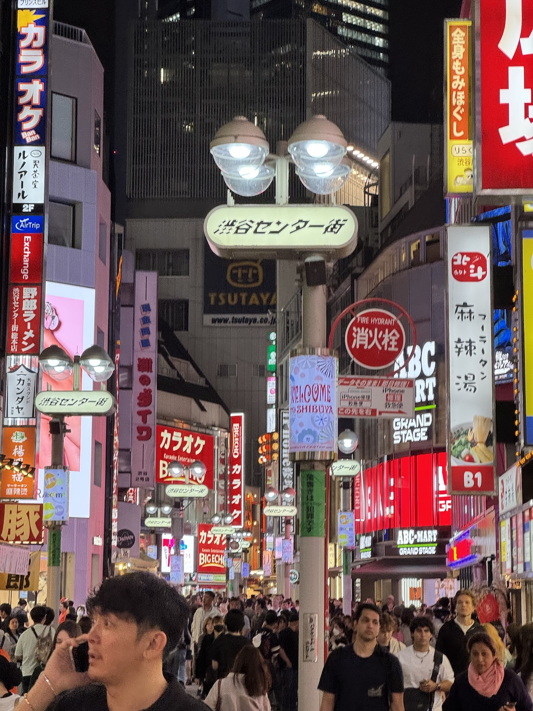</a>
    </figure>
    <figure>
        <a href="../images/shibuya2-2025.jpg" data-caption="CHI 2025 Closing Plenary (Yokohama, Japan)">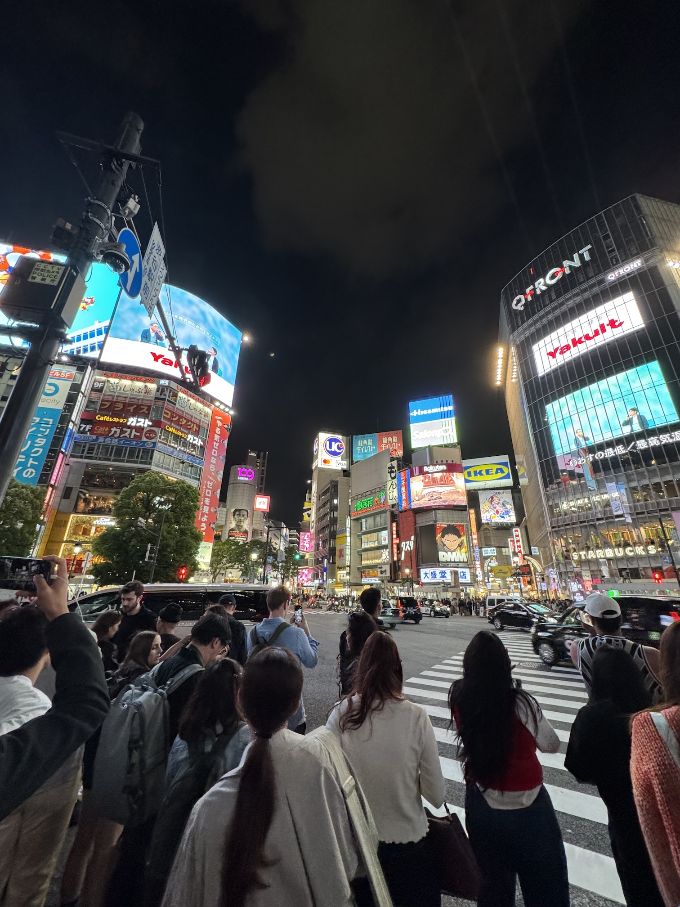</a>
    </figure>

Hibby and I took one last trip to Yokohama Chinatown for *nikuman* that night (we actually visited on Saturday night as well, but realized the hard way that most Yokohama Chinatown locations do not accept credit card payments lol). Yokohama Chinatown was very quiet and relaxed this time, few customers around, many businesses closing early; I suspect this was also due to Golden Week. Hibby and I enjoyed our *nikuman* very much; I have fond memories of eating *nikuman* in Yokohama Chinatown as a little child, and remember them being as large as my face! Maybe they aren't anymore, but my face *was* a bit smaller when I was 4 years old. 

    <figure>
        <a href="../images/chinatown1-2025.jpg" data-caption="Yokohama Chinatown (Yokohama, Japan)">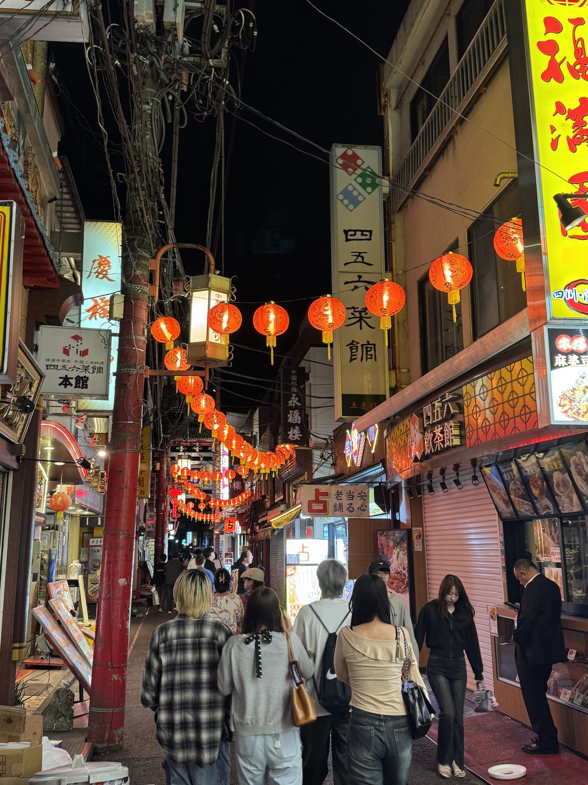</a>
    </figure>
    <figure>
        <a href="../images/chinatown2-2025.jpg" data-caption="CHI 2025 Closing Plenary (Yokohama, Japan)">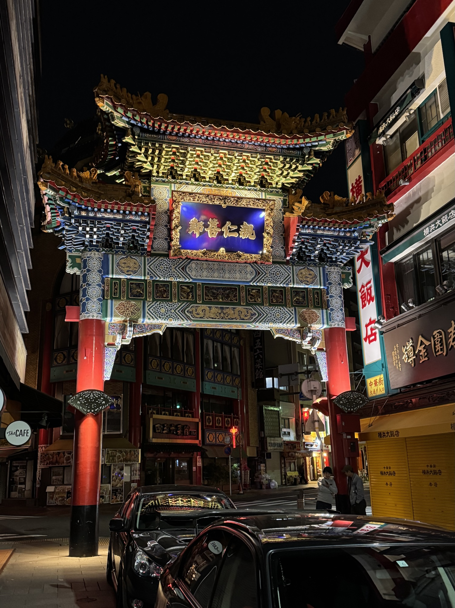</a>
    </figure>

...Damn. I'm really going back tomorrow morning. Feels like I just got here. So much more I wanted to do. ...Next time.

### 02 May (Friday)
Woke up, packed my remaining things, grabbed one last *konbini* breakfast (rice, fish, renkon, lots of other vegatables), checked out from the hotel, said bye to Hibby (who departed for a different hotel in Tokyo), then entered Sakuragichō-eki for a train to Yokohama-eki, and from there to Haneda Kūkō. God, I'm going to miss these trains so much. 

Met some other departing CHI attendees in-line at the airport check-in; we mostly talked about conferencing in general, navigating academia in 2025, businesses cards, and feeling burnt-out from screens. One uncomfortable pat-down (hate it everytime) and one overpriced food court *okonomiyaki* later ($12 and it's the size of a pancake? Get real!), I sat in the terminal and caught one last glimpse of Japan out the windows before boarding my plane. Cool, grey, and rainy outside. 

    <a href="../images/haneda-2025.jpg" data-caption="A few outside the window at Haneda Airport (Tokyo, Japan)">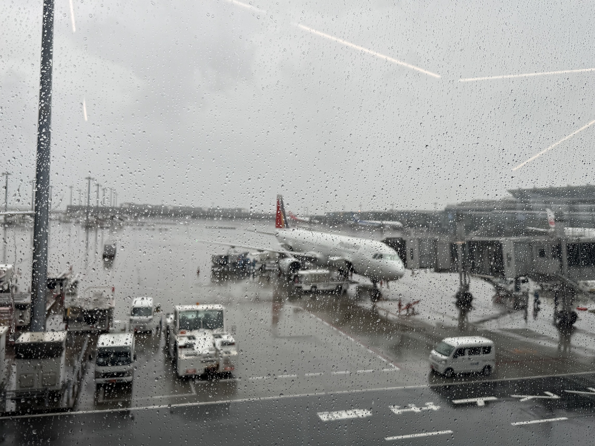</a>

...Farewell, Yokohama. I didn't know how much I missed you. I will come back one day.

---

One twelve hour flight (and a bus ride from DTW to Ann Arbor) later, I found myself... right where I was one week and a day ago. Ann Arbor changes quickly in early May. The trees fill with blossoms and young leaves, proud graduates walk around in caps and gowns, the roads jam up with minivans and U-Hauls (but only for a short while -- State Street's not so bad once the undergrads leave). 

I felt a little disoriented at first, reminding myself to use English and to stay on the right side of the sidewalk. I thought about the pedestrian walkways in many Japanese cities that connect major transit hubs to popular destinations. I thought about how my grandmother and her friends would take train rides on the weekends from her remote rural mining town all the way to Fukuoka. I thought about how Ann Arbor is a little dorito-shaped town nestled between three major freeways, and how getting anywhere in under half an hour requires a car. I wondered how easily my grandmother could visit her friends if they all lived here.

I got home, ate a cheeseburger, took a shower, and went to bed. 