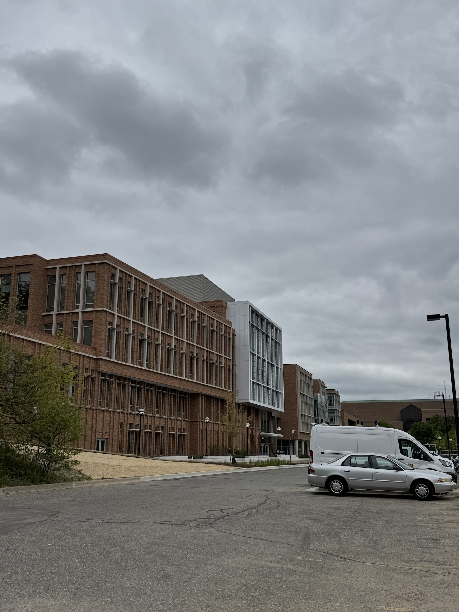

    

Hello! It's been getting warmer in Ann Arbor since I returned from Yokohama a few weeks ago. With warm spring temperatures comes budding leaves, blooming flowers, and the worst seasonal allergies I've dealt with in years -- I knew lingering by those pine trees was a bad idea! (╥﹏╥)

### In research news:

Several of my colleagues' papers have been accepted to multiple conferences in the past few months. My friend <a href="https://www.iamfriak.com" target="blank"><b>F.R. Khan's</b></a> work-in-progress has been accepted to the ACM Designing Interactive Systems Conference 2025 (aka <a href="https://dis.acm.org/2025/" target="blank"><b>DIS 2025</a></b>) -- congratulations! ( ˶ˆᗜˆ˵ )

- ***<a href="https://programs.sigchi.org/dis/2025/program/content/200606" target="blank">The Vibes are Off: Considering Embodied Reflections by TBIPOC to Account for Displacement and Discomfort in Makerspaces</a>,*** authored by F.R. Khan, Apryl Williams, Tawanna Dillahunt, and Oliver L. Haimson

And an update to one of my <a href="https://www.mayworms.info/posts/2025-04-14.html" target="blank">earlier posts</a>: three papers from our lab (including one that I helped co-author!) have been accepted to the ACM Conference on Fairness, Accountability, and Transparency 2025 (aka <a href="https://facctconference.org" target="blank"><b>ACM FAccT 2025</a></b>) -- congratulations to all authors of these works! ٩(ˊᗜˋ*)و

- ***<a href="https://doi.org/10.1145/3715275.3732081" target="blank">AI Attitudes Among Marginalized Populations in the U.S.: Nonbinary, Transgender, and Disabled Individuals Report More Negative AI Attitudes</a>,*** authored by Oliver L. Haimson, <b>Samuel Mayworm,</b> Alexis Shore Ingber, and Nazanin Andalibi   
- ***<a href="https://deepblue.lib.umich.edu/handle/2027.42/197724" target="blank">TIDEs: A Transgender and Nonbinary Community-Labeled Dataset and Model for Transphobia Identification in Digital Environments</a>,*** authored by Francesca Lameiro, Lavinia Dunagan, Dallas Card, Oliver L. Haimson, and Eric Gilbert   
- ***<a href="https://deepblue.lib.umich.edu/bitstream/handle/2027.42/197726/facct2025-final168.pdf" target="blank">Distinguishing Emotion AI: Factors Shaping Perceptions Including Input Data, Emotion Data Recipients, and Identity</a>,*** authored by Alexis Shore Ingber, Oliver L. Haimson, and Nazanin Andalibi   

I wish I could travel to Greece for ACM FAccT 2025, but unfortunately cannot make it this year; I hope everyone else attending has a good time! ദ്ദി´ ˘ `)✧

### In PhD news:
I'm just about ready to submit my pre-candidacy proposal, aka the first major milestone of my PhD program! Thinking about completing one of my PhD milestones feels so surreal -- the first year of my program sure flew by quickly, didn't it? Academia in the USA changed so much in that brief time... feels like a very different world from when my program began.

Also: the University of Michigan School of Information (<a href="https://www.si.umich.edu" target="blank"><b>UMSI</b></a>) recently moved from the North Quad building in Central Campus to the new <a href="https://leinweber.bldg.umich.edu" target="blank"><b>Leinweber Building</b></a> in North Campus! The Leinweber Building is really nice, though they're still working on the finishing touches (the walls and hallways are very blank at the moment, so it's very easy to get lost looking for your office LOL). 

    <figure>
        
    </figure>
    <figure>
        
    </figure>

Though I miss our old downtown location, I appreciate the new facilities as well. Leinweber feels a little empty with so many faculty members and students out of town at the moment, but those of us here are doing our best to (quoting Ria Khan) *"make this cage a house!"* ( ◡̀_◡́)ᕤ

### In personal news:
My friends and I visited the <a href="https://toledomuseum.org" target="blank"><b>Toledo Museum of Art</b></a> a few weeks ago, the <b><a href="https://toledomuseum.org/exhibitions/rachel-ruysch-nature-into-art" target="blank">Rachel Ruysch exhibit</a></b> was amazing! It struck me at one point that the exhibit's paintings were all around 300 years old... I wonder if anyone will look at my art (or read my papers!) 300 years from now? (,,•o•,,)

    <figure>
        
    </figure>
    <figure>
        
    </figure>

I also started playing <a href="https://metaphor.atlus.com/index.html?lang=en" target="blank"><b>Metaphor: ReFantazio</b></a> a few weeks ago, and am really enjoying it! Metaphor's my first Atlus game (I've watched playthroughs of Persona 3/4/5 but never had consoles to play them on); while the learning curve was a little tough at first, I feel like I'm cruising pretty comfortably through the game now. It's hard to tell how *far* I am in the game though -- I'm about 20~25 hours in, but it still feels like I'm in the early game? Some folks have told me that an ordinary Metaphor playthrough can take upward to 100 hours to complete... we'll see how long my playthrough goes! ( • ̀ω•́ )✧