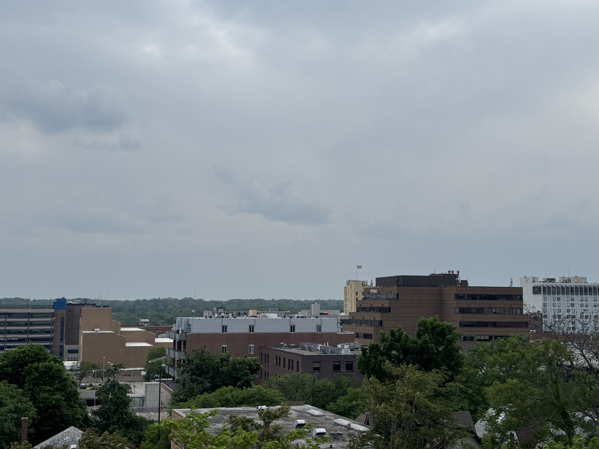

    

Hello there! Summer quickly approaches as we make our way through June. I've been getting outdoors and exercising more lately now that the weather's improved. I had a rough time with seasonal allergies late last month, but the worst of it seems to have passed for the year (thank goodness!).

### In PhD news:
Good news: I recently completed my first PhD milestone! My submitted precandidacy proposal was approved about two weeks ago; the actual study will take place throughout the summer. The focus of my study (at least at this stage) is better understanding how trans Bluesky users conduct community care and support practices on the platform during the current wave of anti-trans political sentiment in the United States. What are they doing to look after one another on this new platform? How are they using Bluesky's unique affordances to look after one another on this platform? Is Bluesky supporting their online goals in a way that would make the platform count as a "trans technology?" ...We will see! (ᵕ,•ᴗ•)

### In personal news:
(Spoiler-free description of Metaphor: ReFantazio below!)

Finally finished the final **Metaphor: ReFantazio** boss battle this morning, which means I've all but completed the game! Metaphor: ReFantazio was somehow my first Atlus game (I've watched Persona playthroughs and the Persona 4 anime before, but have never played Persona or Shin Megami Tensei before), and the first JRPG I've played outside of Pokemon (Pokemon counts, right?) since... god, since I was a teenager. The length of the game surprised me at first, as did the time management system, but I got the hang of how to balance all my ingame tasks, conversations, dungeon crawls, etc as I continued through the game. 100 hours later and I was confronting [SPOILER] at the [SPOILER] after discovering that [SPOILER] is actually the [SPOILER] of [SPOILER] -- crazy, right? (  ≧ᗜ≦)

Metaphor: ReFantazio's writing received lots of praise when it came out, including for its depiction of (sorta) electoral politics, of (fantasy) racism, and of society's descent into apathy in the face of systemic oppression and despair. I... do not share that praise of the game's political writing LOL. For all of Metaphor's amazing character-writing and world-building, it didn't really approach (fantasy) racism, classism, systemic oppression, warfare, etc, *that* differently from titles like the Tellius Fire Emblem games (Path of Radiance and Radiant Dawn). 

I'll say more about Metaphor Re:Fantazio (and my mixed feelings on its social commentary) in the future, perhaps once I've set up a spoiler tag system for my website! But in the meantime... it's a fun game, the characters and the world itself are amazingly written -- its politics are what you'd expect from an anime-adjacent JRPG, but what else is new? Either way, I deeply hope that Atlus does more with the Metaphor franchise in the future. I also wonder if... sorry, it's hard to muse on a 100+ hour game without including *some* spoilers. (ᵕ,—ᴗ—,)