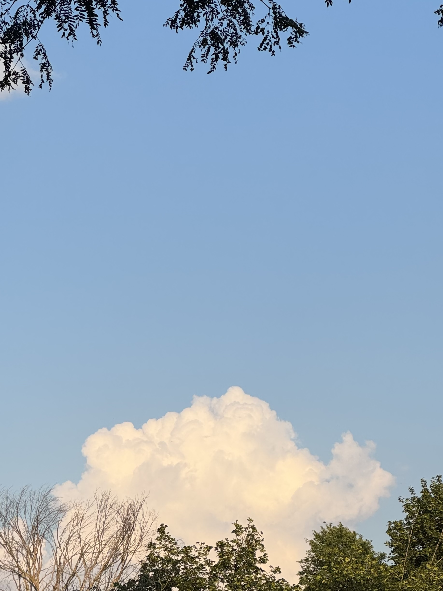

    <figure>
        
    </figure>
    <figure>
        
    </figure>

Hello there! It's been quite hot in Ann Arbor recently (which makes sense, it's July, but that doesn't mean I like it!). It rained last week but has been completely dry since then... hopefully this changes by Sunday! (٥*˘▿˘) ﾞ☂･˙｡°･ˇ

### In research news:
The University of Michigan School of Information (UMSI) released a <a href="https://www.si.umich.edu/about-umsi/news/marginalized-americans-are-highly-skeptical-artificial-intelligence" target="blank"><b>news article</b></a> on our newest ACM FAccT publication, ***<a href="https://doi.org/10.1145/3715275.3732081" target="blank">AI Attitudes Among Marginalized Populations in the U.S.: Nonbinary, Transgender, and Disabled Individuals Report More Negative AI Attitudes</a>*** (led by Oliver L. Haimson and coauthored by myself, Alexis Shore Ingber, and Nazanin Andalibi)! I've included the paper's abstract (aka a quick summary) below; give it a read if you find it interesting ( ੭ ･ᴗ･ )੭

#### *AI Attitudes Among Marginalized Populations in the U.S.* abstract:
<blockquote cite="https://doi.org/10.1145/3715275.3732081">
  

    As artificial intelligence (AI) technologies become increasingly pervasive, understanding public perceptions of AI is crucial for ensuring equitable adoption and impact. <b>Attitudes toward AI</b>, such as whether it is seen as <b>helpful or harmful</b>, may <b>vary based on social identities and lived experiences.</b>
 

 

    In this study, we conducted a survey (<i>n</i> = 742) including a representative U.S. sample and an oversample of gender minorities, racial minorities, and disabled individuals to examine how demographic factors shape AI attitudes. Our findings reveal that in the U.S. context, <b>participants who are nonbinary, transgender, and/or women,</b> and <b>disabled participants,</b> particularly those who are neurodivergent or have mental health conditions, <b>report significantly more negative attitudes towards AI compared to majority groups.</b>
  

  

    We argue that these disparities highlight a critical issue: <b>negative AI attitudes among marginalized communities signals a continued failure to account for their needs and concerns in AI design and use.</b> That marginalized Americans have more negative views towards AI should prompt reflection and critical examination of the prevalent rhetoric of AI’s purported inevitability and its framing as a universal social good. 
  

</blockquote>    

### In personal news:
My week's been pretty good! Really enjoyed Pokemon Go Fest 2025 in downtown Ann Arbor last weekend. Ann Arbor/Ypsilanti has a big Pokemon Go community, so many people showed up downtown to look for raids and catch shiny Pokemon (and to make friends with one another!). I spent some Go Fest time exploring Ann Arbor (mostly in Kerrytown) with a good friend, and spent some time playing on my own, wandering around looking for raids, talking to other players, and enjoying the sun ◝(ᵔᵕᵔ)◜ 

    <figure>
        
    </figure>
    <figure>
        
    </figure>

There was a slight incident on Go Fest Day 2 though; a man on the street saw my earrings and started shouting angry homophobic comments at me! One of his comments stuck out to me -- *"what is this, national Gay Day??"* A part of me wanted to respond, *"Pride Month, actually!"*, and another part of me wanted to respond, *"is that the best you've got?"* But yet another part of me wanted to avoid escalating the situation (he was walking a large, very unhappy-looking dog -- not as unhappy as the man though), so I wound up saying nothing until he walked off. A few PoGo players looked at me sympathetically, and I didn't know what I was supposed to say, so I tried to laugh it off -- *"can you believe that's the second time that's happened this week?"* Which is *true,* but (judging by the other players' reactions) probably wasn't very reassuring. Blagh. 

I've experienced more homophobic/transphobic harassment in public these past few months than I have since leaving West Michigan in 2020. West Michigan bigotry was mundane -- I *expect* violent homophobia and transphobia in the deeply evangelical part of the state, I grew up in it, it sucked. It sucks feeling it here too. Nowhere is perfect, but it hurts feeling less safe (no matter where!) by the day. 

Things have been nice outside that homophobic incident though! Watched <a href="https://www.instagram.com/zorarooibos/?hl=en" target="blank"><b>Zora Rooibos</b></a> perform at Ziggy's in downtown Ypsilanti two weeks ago (my sister's friend played the drums!), picked another good friend up from the airport the other night (getting to DTW was fine, but dealing with all the 4th of July traffic at arrivals/baggage? Nightmare!), and made progress on my usual research/precandidacy study tasks. I also won my very first game of Fortnite last night -- granted, it was my first game, I was probably queued against bots and brand-new players... but still, got my first Fortnite win before 30 (⌐■‿■) 

---

(Oh right, on that note: my 30th birthday is tomorrow!! I'll have more to say about it once I actually turn 30, but for the time being, I'm going to focus on birthday party preparations ヾ( ˃ᴗ˂ )◞ • *✰)