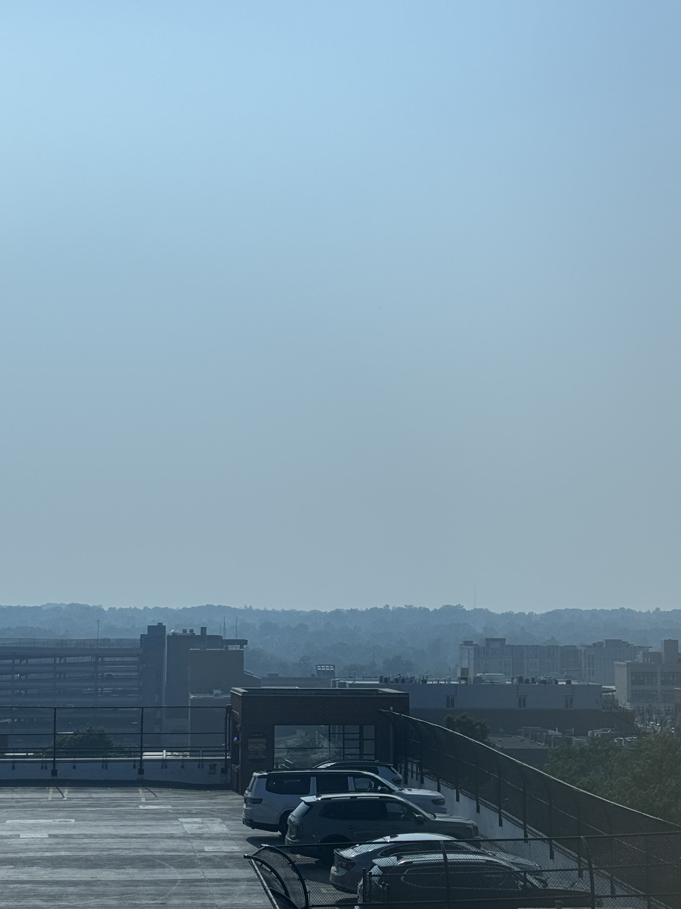

    <figure>
        
    </figure>
    <figure>
        
    </figure>

Hello there! It is currently 05 August, 2025, and the weather outside (minus the wildfire smoke) is beautiful. It may or may not rain sometime tomorrow, and maybe some more after that. I'd better enjoy the rain while it's still warm outside -- I know I'll resent the rain once it's chilly.

### In research news:
This past Sunday (03 August), my colleagues <a href="https://www.si.umich.edu/people/lu-xian" target="blank"><b>Lu Xian</b></a>, <a href="https://shwetharajaram.github.io" target="blank"><b>Shwetha Rajaram</b></a>, and I spoke at the <b>Extra Credit improv show</b> hosted by <a href="https://www.heardotsay.com/shows" target="blank"><b>hear.say brewing + theater</b></a> in Ann Arbor, MI! The premise of Extra Credit is really cool: on the first Sunday of every month, researchers, faculty, and students from the University of Michigan School of Information are invited to give a 10 minute talk or interview about their research at the show; following their talk, the Extra Credit improv crew perform 10 minutes of skits themed around the speakers' research! 

UMSI Associate Professor <a href="http://www.gabrielamarcu.com" target="blank"><b>Gabriela Marcu</b></a> interviewed me about my work on trans user communities on social media, along with my experiences completing year one of my PhD -- I had so, so much fun sharing my work with the audience! I'll update this post with links to interview footage once it's available ദ്ദി ( ᵔ ᗜ ᵔ ) 

### In PhD news:
The precandidacy study (a digital ethnographic study of trans Bluesky users' community support and care practices) continues to go well! There's so much to learn from how trans people create and sustain community on social media platforms that weren't necessarily built in ways that accomodate them. Sometimes I find myself reluctant to "participate" on the platform (a necessary part of participant-observation), but the more I think about it, the more I think my reluctance is a product of the platform itself. Can't wait to learn from trans users' insights during the project's interview study phase! (˵ •̀ ᴗ •́ ˵ ) ✧ 

On another note: holy cow, classes start back up in about 3 weeks! If everything goes correctly, I should complete my final required courses this year -- this will probably be the last year in which I ever take university classes. How do I feel about it? Hm... relieved? Bittersweet? Thankful? Melancholy? Most of my life was spent as a student in some capacity, and watching that era come to an end feels more surreal than turning 30 last month. ...Good god, I turned 30 last month! ( ˶°ㅁ°) !! 

### In personal news:
I experienced quite a few hardships these past few weeks, between two dentist appointments, a serious medication reaction that I'm still recovering from (it was scary, but don't worry, I'm okay!), and my current apartment's leasing office catching on fire and burning to the ground. 

Right: our apartment's leasing office burned to the ground yesterday! No one was harmed as far as I know (thank god), and it's still not clear how the fire actually started. Many basement units near the office were severely flooded from firefighting activity, several tenants have had to evacuate as a result (to where? Do they all have somewhere to go?). 

My roommate and I are incredibly fortunate in that 1) our unit is located far from the leasing office, 2) we do not live on the basement floor, and 3) we're moving out in about 2 weeks. But I feel absolutely horrible for the tenants who experienced flooding damage and displacement because of the fire, particularly those who just moved in a few days ago... good lord. 

### In website news:
I recently installed the Lite YouTube Embed plugin to this website; embedded YouTube links should render quite a bit faster now! To test the new plugin, I've embedded a link to my friends' 2021 short film <i>Heads or Tails 2</i> below:

<lite-youtube videoid="W5LNlOhgFcg" playlabel="Play: Heads or Tails 2"></lite-youtube>

Let me know if you encounter any playback errors! ദ്ദി ( ᵔ ᴗ ᵔ ) 