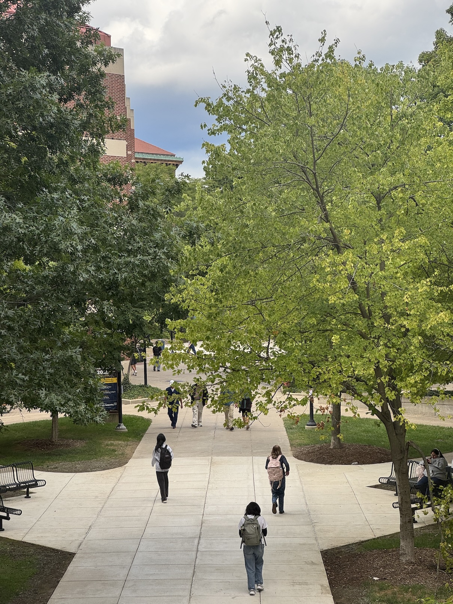
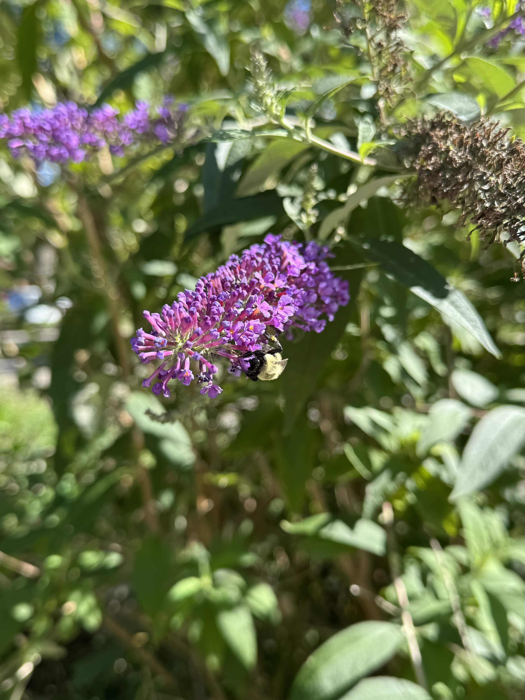

    <figure>
        
    </figure>
    <figure>
        
    </figure>

Hello there! The weather cooled rapidly in Ann Arbor this past week, mostly drizzly in the mid-70s around here. Good weather for taking a walk downtown -- let's hope it stays that way for a while! (˶ˆᗜˆ˵)

### In PhD news:
Fall 2025 semester (and year 2 of my PhD program) started this week! This is probably the last year in which I'll have to take classes... I wonder how I feel about that? Maybe "bittersweet" -- though I look forward to finishing classes for good, I *have* been a student in some capacity for most of my life, and completing that part of my life could feel weird.

But that's all the more reason to make the most of my classes while I'm in them! I'm particularly excited to take an ethnographic writing course with <a href="https://lsa.umich.edu/idpah/people/faculty/rbehar.html" target="blank"><b>Ruth Behar</b></a> this year -- my writing has much room for improvement! 

### In personal news:
My roommate and I moved apartments last Friday! The past week has been spent unloading furniture and unpacking boxes between classes, lab meetings, and other PhD-related tasks. My bed frame broke during the move as well, so I need to find another one around here soon too. ...No wonder I've been so tired lately! zzz(´〜｀*)

The new apartment's location is excellent, much closer to downtown (and a wider range of bus stops) than our old place. It's fairly easy for me to head downtown to play Pokemon Go, visit friends, grab a bite to eat... it rules not having to drive everywhere anymore. (⁠ ⁠ꈍ⁠ᴗ⁠ꈍ⁠)

I also had lunch with a friend on Wednesday at my favourite hoagie place. We spoke for a while about his philosophies as a karaoke DJ, his most and least favourite types of karaoke guests, intentionally fostering an inclusive space for all attendees, and how to sing a song that may not fit our vocal ranges (turns out he can pitch songs down for you!). You ever spend time with friends and feel your community (and world!) grow? I enjoy those moments very much. (˶˃ ᵕ ˂˶)

### In website news:
Currently implementing a tag cloud system on mayworms.info (based on Renkon's tag cloud system on their <a href="https://renkotsuban.com/posts/2025-07-25-Updates-to-the-Eleventy-guide.html#install-everything" target="blank"><b>updated Eleventy starter guide</b></a> -- thank you for the amazing guide, Renkon!). You might not know it, but I've included invisible "category" tags on each blog post so far (e.g. "PhD," "Research," "Website," "Updates," etc), but never figured out how to make these tags searchable on my website. Hopefully they will be soon!