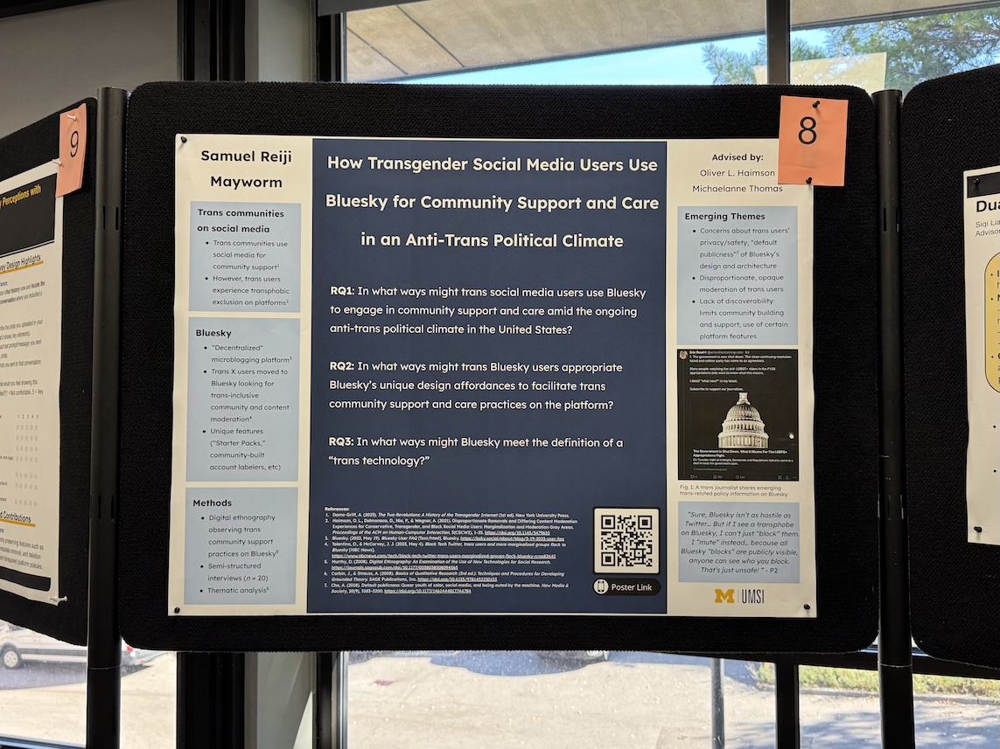

    <figure>
        
    </figure>
    <figure>
        
    </figure>

Hello there! The weather has finally cooled down in Ann Arbor; autumn feels like autumn at last. I've pulled my jacket out of the closet already... how long until I need my parka? ༄ ⋆⁺₊❅.

### In PhD & research news: 
Last Friday, I presented a poster at the second annual University of Michigan School of Information (UMSI) <a href="https://www.si.umich.edu/about-umsi/events/pre-candidacy-proposal-showcase" target="_blank"><b>Pre-Candidacy Proposal Showcase</b></a>! During the pre-can showcase, second-year UMSI students present on our pre-candidacy research projects (the first major research project we conduct between the first and second years of our programs). Presenting on my in-progress (nearly complete!) project was lots of fun, and I received lots of helpful feedback from other UMSI students and faculty along the way. (˶ˆᗜˆ˵)

    

I always feel a bit nervous presenting trans-specific research to a predominantly cisgender audience, partially because I never know how much *they* know about trans people's experiences (online and in general). It feels kind of surreal explaining things like, "yeah, we often make use of social media/online communities because so much of the physical world excludes us," or "despite that, social media platforms treat us like garbage too" -- facts I take for granted and forget that most cis people *don't know.* The audience I spoke with was very eager to learn however, I'm glad they were receptive of my work. :)

    

(Check out these <a href="https://www.instagram.com/p/DPzN7pFj1NJ/" target="_blank"><b>photos</b></a> from the showcase! Lots of excellent presentations showcased here, such as <a href="https://www.iamfriak.com" target="_blank"><b>F. Ria Khan</b></a> and <a href="https://www.si.umich.edu/people/hana-chung" target="_blank"><b>Hana Chung's</a></b> work!). 

### In personal news:
One of my professors once warned me that the second (and third!) years of the PhD are usually the busiest. Judging by how little time I've had to update my blog since Fall semester began, I think he is probably right. Overwork has been a serious issue for me throughout my adult life, and I'm doing everything in my power to finish all my work this semester without falling backwards into burnout! (𖦹﹏𖦹;)

My therapist suggested that I make time every week for fun things completely unrelated to work, and I think I've managed to do this so far. I attend karaoke with friends most weeks, keep up with football (and all those Lions defensive injuries...), play Pokémon Go (and will play <a href="https://legends.pokemon.com/en-us" target="_blank"><b>Pokémon Legends: Z-A</a></b>), find time for movies sometimes. I visited a friend to celebrate her cat's 23rd birthday party, helped some other friends press apple cider, and found some time to reapply rain repellant on my car's windshields. All that to say: while life will be very busy these next few years, I'll try not to let work completely take over my life!

Side note: I also checked out a sewing machine from the <a href="https://aadl.org" target="_blank"><b>Ann Arbor District Library</a></b> last weekend, and used it to crop one of my oversized t-shirts! I hadn't used a sewing machine before, and mostly went off tutorials I found on TikTok and YouTube -- the end result came out really well! I have to return the sewing machine to the library this weekend, but perhaps I'll check it out again sometime (or maybe invest in my own! Lord knows I own too many shirts that are just a little too long for me lol).