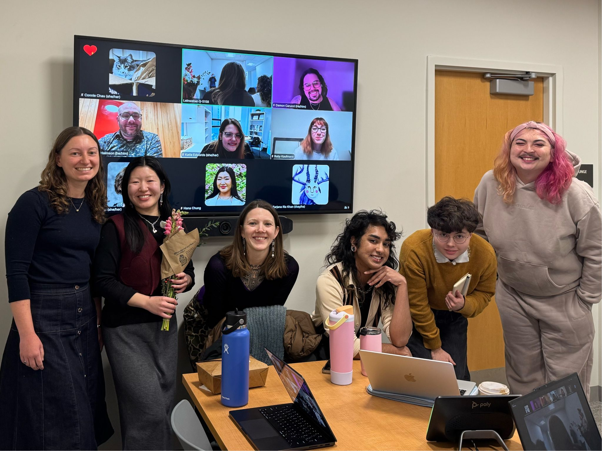
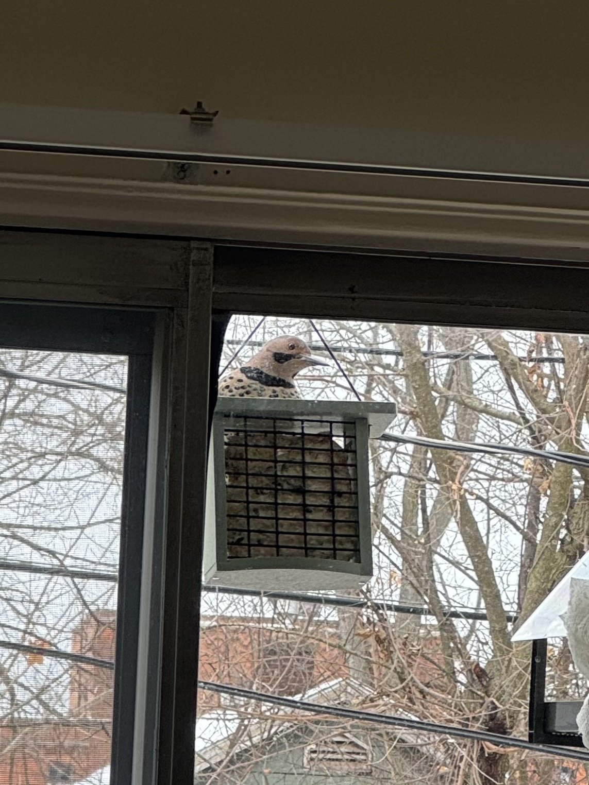

    <figure>
        
    </figure>
    <figure>
        
    </figure>

Hello there! Ann Arbor (and Michigan generally) got quite snowy and cold these past few weeks. I forgot to scrape the snow off my car the other day, which melted and froze overnight into ice -- an unpleasant surprise before my morning commute (˃̣̣̥ ︿ ˂̣̣̥)

### PhD & Research 
Fall 2025 semester is coming to a close -- funny, it feels like this year's classes just started (I think I said that last Fall, too). I'm particularly thankful for my experience taking Ruth Behar's ethnographic writing course this year! Dr. Behar's course made me critically about how I’ll approach ethnographic writing in HCI research… is there room for more creativity in how I write about online communities? I think there is! (っ •ᴗ•) 

    

I would also like to congratulate my friend <a href="https://www.si.umich.edu/people/hana-chung" target="_blank"><b>Hana Chung</b></a> for successfully defending her <a href="https://www.linkedin.com/posts/gabriela-marcu-1b33014_congratulations-to-hana-chung-on-a-successful-activity-7404931822570119169--qMJ/" target="_blank">pre-candidacy milestone</a>! Very excited to fully explore her pre-candidacy work, titled: <b><i>“Investigating mobile applications for survivors of intimate partner violence to design in support of LGBTQ+ populations.”</i></b> Hana, if you’re reading this: I’m very proud of you, well done! ( ^▽^ )

### Personal 
It feels surreal every time the semester ends and I finally get (some of) my personal time back! When Fall semester ended last year, I <a href="https://www.mayworms.info/posts/2024-12-12.html" target="_blank">reflected on</a> visiting Steak & Shake before watching *The Green Knight* with friends, debating amongst ourselves whether Josh Allen or Lamar Jackson would win NFL MVP that year (it went to Josh Allen). I'm seeing a movie this Thursday with the exact same friends, and we'll probably talk about the exact same things: work, school, and this year's MVP race (this time between Matt Stafford and Drake "<a href="https://www.instagram.com/drakemayelover/" target="_blank"><i>Drake Maye</i></a>" Maye). Life since starting the PhD has been turbulent and ever-changing, which makes me thankful for the good things (friends, places, hobbies, and other sources of joy) that I can always depend on.

    <figure>
        
    </figure>
    <figure>
        
    </figure>

I've found time between work/research for fun too! Visited <a href="http://kerrytowndistrict.org/kindlefest" target="_blank">KindleFest</a> in Kerrytown/Main St. and the <a href="https://aadl.org/tinyexpo" target="_blank">Tiny Expo</a> in the downtown Ann Arbor District Library branch (this town is so active around the holidays!). I've also kept up with <i>Pokémon Go</i> (and the <i>Pokémon Legends: Z-A</i> DLC!) and this year's Detroit Lions season (I miss when half our roster wasn't injured). 

Life keeps happening no matter how much I shove it aside for work; perhaps there's a lesson to learn from this (ᵕ,—ᴗ—,)

### Birds

    <figure>
        
    </figure>
    <figure>
        
    </figure>

One thing I love about our current apartment is its small outdoor balcony, a great place to to sit, relax, grow plants in warmer months... and to hang a few bird feeders! 

I added a bird feeder to the balcony in late November (and a smaller suet feeder just last week), wondering if it would help the local bird population during the winter. It took a week for the first bird to visit the original bird feeder (a small brown finch who only stayed for a moment, darting away before I could take a photo). Imagine my surprise when an entire flock of finches (along with some sparrows and juncos) visited the next day! 

We have quite the regular bird community visiting our balcony now; mostly the same crew of finches, sparrows, and juncos, along with some nuthatches, downy woodpeckers, chickadees, several cardinal pairs, and some Carolina wrens. There are also some shyer visitors who only come every once in a while, such as a mourning dove (who's become more comfortable near the finches lately), several blue jays (I set some peanuts out for them!), a beautiful red-bellied woodpecker (the reason I bought the suet feeder last week), a gorgeous northern flicker (easily our largest visitor), and a crow who never approaches, but watches from afar. 

    <figure>
        
    </figure>
    <figure>
        
    </figure>

Our balcony has a few features that make it easier to maintain the bird feeders. There are no easy routes for squirrels or other critters to visit, so I haven't had to worry about them competing for bird seed. Sometimes I worry about what might happen if a hawk enters the neighborhood... I don't get to choose which birds enter the area, but I do hope no one scares the smaller, more vulnerable birds away (╥﹏╥)

I personally chose not to adopt any pets until I move out from Ann Arbor. Our bird neighbors have been a nice compromise in that way; though it's ultimately their choice whether to visit our balcony, I do enjoy their company when they do (˘͈ ᵕ ˘͈)

### Website
You may have noticed the "Table of Contents" button on top of this blog post -- a new feature I added to the website last weekend! Some of my blog posts (such as longer reflections on <a href="https://www.mayworms.info/posts/2025-10-17.html" target="_blank">PhD milestones</a> or <a href="https://www.mayworms.info/posts/2025-04-27.html" target="_blank">research conference travel</a>) can run quite long, making it difficult to scroll through the whole thing. The "Table of Contents" feature should hopefully improve navigation for longer blog posts -- I like how it works so far! (˶ˆᗜˆ˵)

<b>Table of Contents plugins:</b>
<ul>
    <li><a href="https://www.npmjs.com/package/markdown-it-anchor" target="_blank"><b>markdown-it-anchor</b></a>: <i>"A markdown-it plugin that adds an id attribute to headings and optionally permalinks"</i>
    </li> 
    <li><a href="https://www.npmjs.com/package/eleventy-plugin-nesting-toc#install" target="_blank"><b>eleventy-plugin-nesting-toc</b></a>: <i>"generates a (property nested) TOC from page content using an Eleventy filter"</i>
    </li>
</ul>

Still tweaking the styling (for both the Table of Contents and the markdown anchors themselves) and deciding whether I'll use the ToC feature for every blog post or only particularly long ones. Let me know what you think (or if you run into any issues)! (>ᴗ•) 
