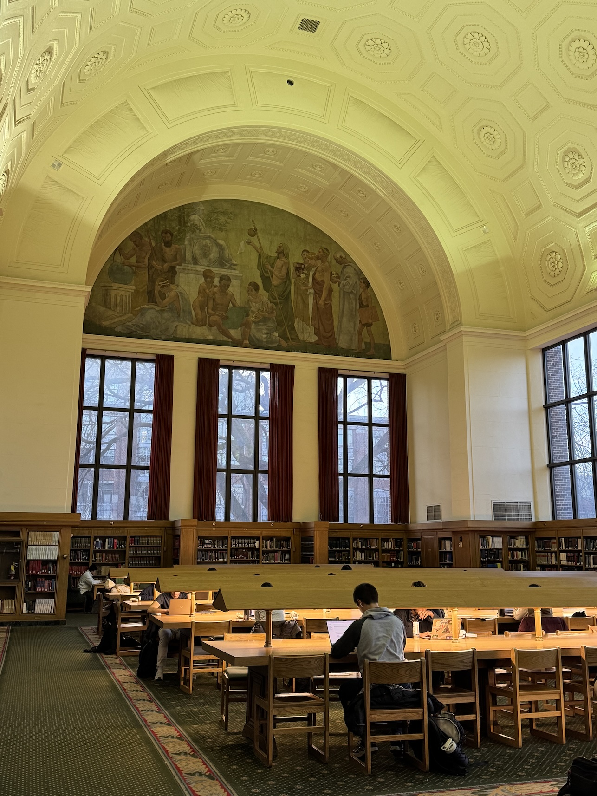
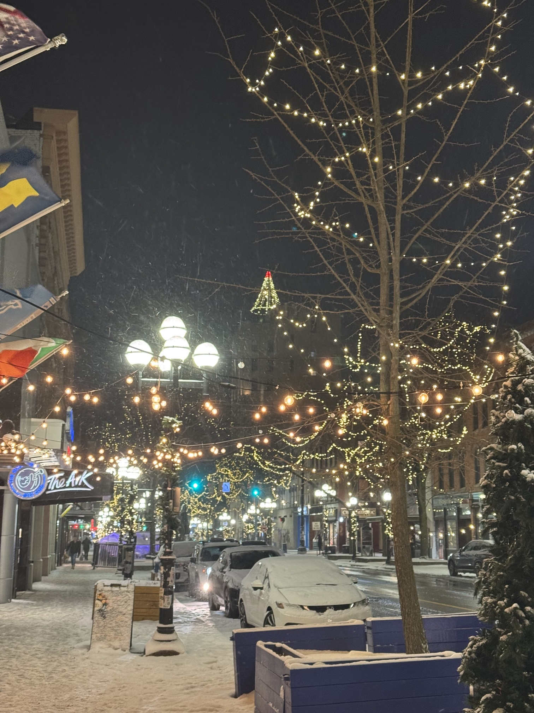

    <figure>
        
    </figure>
    <figure>
        
    </figure>

Hello there! A major winter storm is about to slam a massive part of the country; though Michigan is lucky enough to dodge the worst of it, it will be brutally cold around here for the next week or so, and probably snowy as well... I'd better remember to keep my scarf on me!  ⋆⁺₊❅。 

### PhD 

    <figure>
        
    </figure>
    <figure>
        
    </figure>

I am officially presenting my pre-candidacy paper (my second PhD milestone) in mid-February! Though many aspects of my pre-candidacy study (participant recruitment difficulties, IRB delays, some State Of The World™ concerns, etc) were quite challenging, navigating these challenges definitely helped me grow as a researcher. I'll have more to say once the pre-candidacy paper is officially out in the world; I'm excited to finally share it with you all (˶ᵔ ᵕ ᵔ˶)

The Winter 2026 semester also began a few weeks ago... I can't believe this is (most likely) my last semester taking classes! I think (hope!) courses will be easier to navigate once I've completed my pre-candidacy work! ...Though I will have that GSRA paper to work on... and that workshop paper... and preparing for summer research too... hrm... (𖦹﹏𖦹;)

### Research 
LGBTQ Nation recently published <a href="https://www.lgbtqnation.com/2025/12/ai-disproportionately-discriminates-against-trans-people-it-doesnt-have-to-be-this-way/" target="_blank">an article</a> highlighting <b><i><a href="https://dl.acm.org/doi/10.1145/3715275.3732081" target="_blank">AI Attitudes Among Marginalized Populations in the U.S.: Nonbinary, Transgender, and Disabled Individuals Report More Negative AI Attitudes</a></i></b>, an ACM FAccT 2025 paper led by Oliver L. Haimson and co-authored by myself, Alexis Shore Ingber, and Nazanin Andalibi. The paper featured in this LGBTQ Nation article describes how marginalized populations (especially trans and disabled populations) report particularly negative attitudes toward AI technologies! 

#### AI Attitudes Among Marginalized Populations in the U.S. abstract
<blockquote>

As artificial intelligence (AI) technologies become increasingly pervasive, understanding public perceptions of AI is crucial for ensuring equitable adoption and impact. Attitudes toward AI, such as whether it is seen as helpful or harmful, may vary based on social identities and lived experiences. 

In this study, we conducted a survey (n = 742) including a representative U.S. sample and an oversample of gender minorities, racial minorities, and disabled individuals to examine how demographic factors shape AI attitudes. 

Our findings reveal that in the U.S. context, participants who are nonbinary, transgender, and/or women, and disabled participants, particularly those who are neurodivergent or have mental health conditions, report significantly more negative attitudes towards AI compared to majority groups. 

We argue that these disparities highlight a critical issue: negative AI attitudes among marginalized communities signals a continued failure to account for their needs and concerns in AI design and use. That marginalized Americans have more negative views towards AI should prompt reflection and critical examination of the prevalent rhetoric of AI’s purported inevitability and its framing as a universal social good.

</blockquote>

I would also like to congratulate several of my peers whose papers were accepted to <a href="https://chi2026.acm.org" target="_blank"><b>CHI 2026</b></a>! Will update this post with full details once available -- in the meantime, congratulations to Denny Starks, Hibby Thach, Aloe DeGuia, and Senami Kojah on the CHI acceptances! (˶ˆᗜˆ˵)

Additionally, I would like to congratulate Hibby Thach, whose book chapter with Oliver L. Haimson was recently published in <a href="https://www.bloomsbury.com/us/epistemic-genres-9798765125571/" target="_blank"><b>Epistemic Genres: New Formations of Play</a></b> -- well done, Hibby! ヾ( ˃ᴗ˂ )◞

### Personal 

    <figure>
        
    </figure>
    <figure>
        
    </figure>

In the past month, I've driven back and forth across the state for Christmas, celebrated New Years downtown with friends, met some owls at the <a href="https://aadl.org/node/646207" target="_blank">Ann Arbor District Library</a>, enjoyed a Lord of the Rings watch party, helped collect eggs from a chicken coop, played Pokémon Go with a good friend, kept up with the NFL playoffs, continued maintaining my bird feeders... in other words, the usual! Between the holidays, research, spending time with friends, and the winter semester starting up, this past month has kept me quite busy -- I don't mind that at all though, I enjoy when my life is full. (◜◡◝)

    <figure>
        
    </figure>
    <figure>
        
    </figure>

I would like to bid "farewell" to <a href="https://www.instagram.com/lofi_a2/?hl=en" target="_blank"><b>Lo-Fi</b></a>, the basement bar where my friends and I used to attend karaoke every Thursday night. In mid-December, we discovered quite abruptly that Lo-Fi will remodel and reopen in mid-2026 as a more upscale cocktail bar (excellent, just what Ann Arbor's missing!), and that karaoke would no longer be hosted at the venue. Though there are plenty of other places for karaoke... that was <i>our</i> karaoke bar, you know? Sigh... Ann Arbor's lost quite a few community institutions and third places lately, and it feels awful watching another one disappear, especially one we visited every week. ( ;´ - `;) 

### Website 
Alright, let's address the elephant in the room: the website's green. I originally set a placeholder colour scheme for my website, and didn't wind up changing it for another year. The orange was great, but I felt like it was time for a change. 

I will probably continue iterating on the website's colour scheme over the coming months -- probably no major changes, but who knows what might happen? (ᵕᴗ ᵕ⁎)