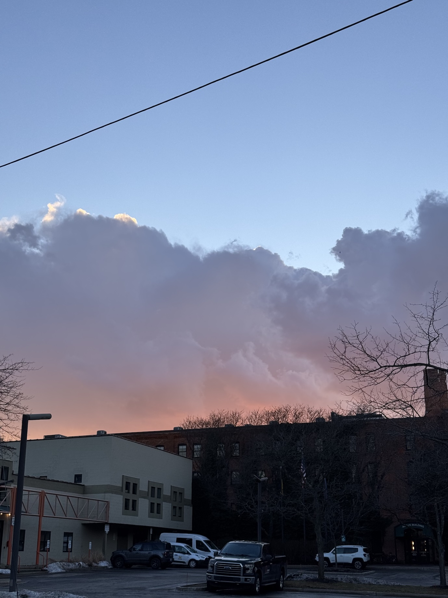
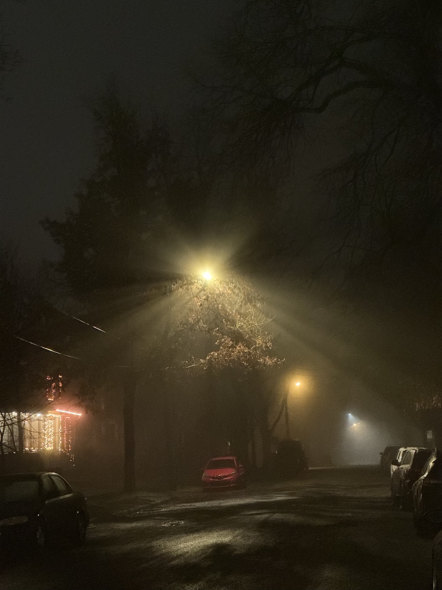
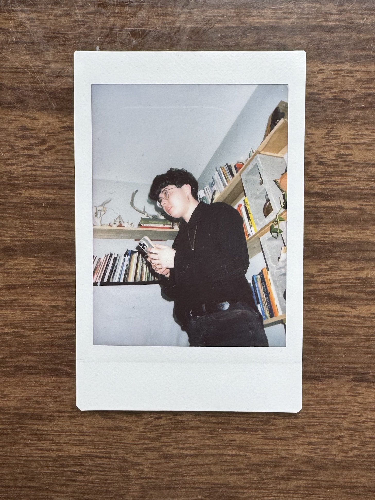
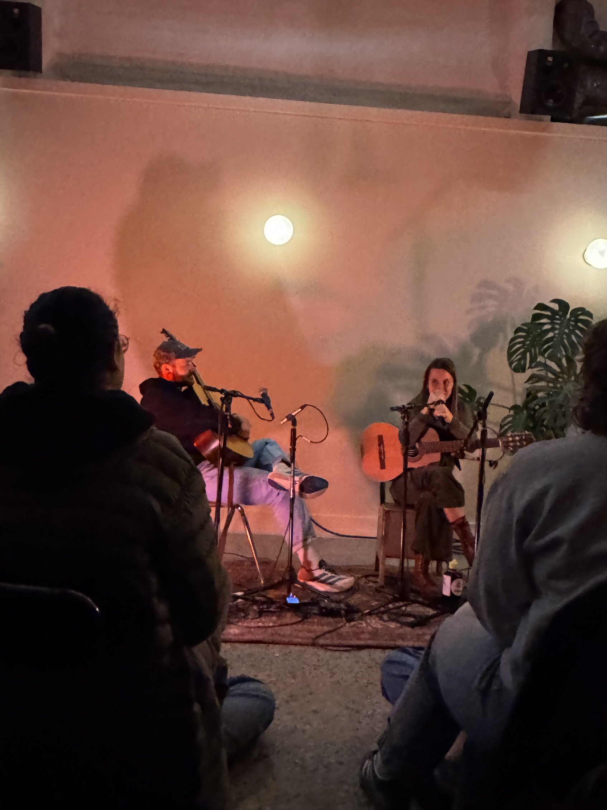
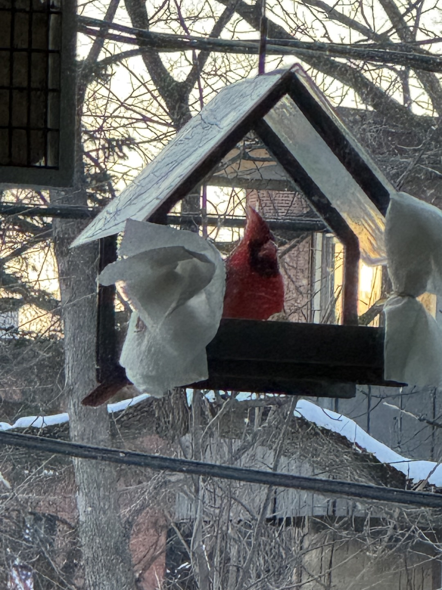
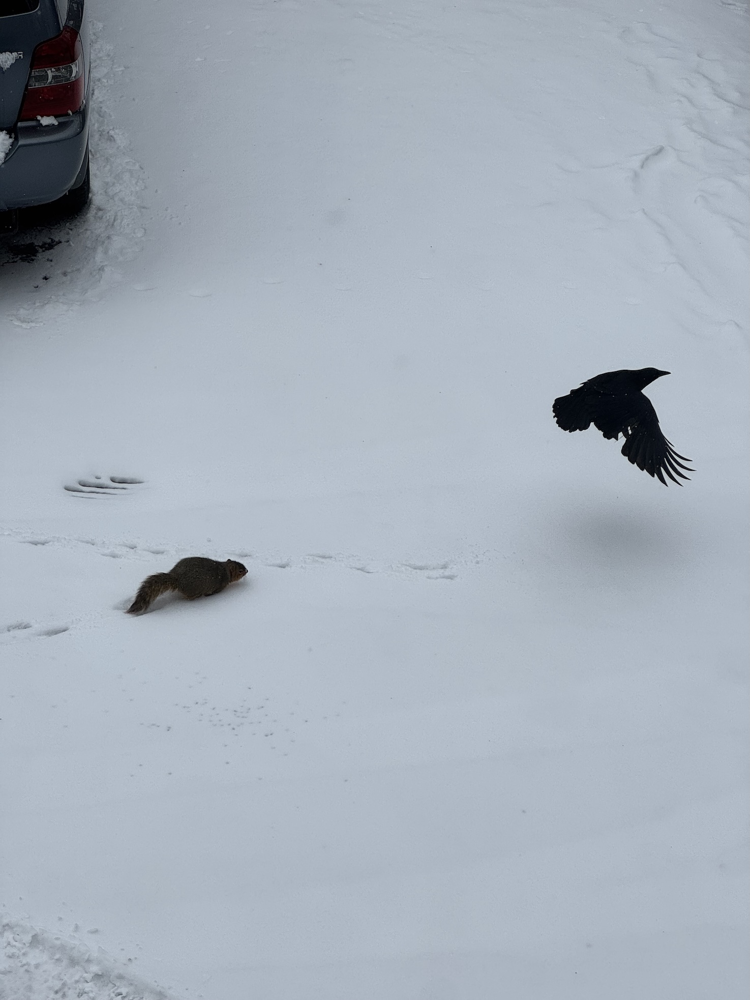

    <figure>
        
    </figure>
    <figure>
        
    </figure>

Hello there! Quite the warm spell in Ann Arbor last week, lots of sunshine too. Great weather for taking a walk downtown... it's a good thing I enjoyed it, because now it's cold and snowy all over again! °❆⋆.ೃ࿔*:･ 

### PhD & Research 
I! Passed! My! Pre-candidacy! Milestone! 

The UMSI PhD program includes several "pre-candidacy" milestones in Years 1 and 2. To pass these milestones, UMSI PhD students design, propose, and carry out their own research study, write a paper on their findings, then successfully present it to their pre-candidacy committee. I submitted my research proposal last spring, conducted the study throughout last summer/autumn, and finished writing the pre-candidacy paper draft in the winter! 

My pre-candidacy study focused on trans Bluesky user communities using the platform for online community support/care, whether they're meeting their trans-specific goals on the platform, if Bluesky's design/architecure actually benefits their goals or not, whether they perceive Bluesky to be a *"trans technology."* Several unanticipated obstacles made the study take longer than expected... but we made it, we're through! Now there's time to revise the written work before submitting it for publication somewhere ( ⸝⸝´ ᵕ `⸝⸝)

Whew... these past few months have been such a crunch that I hardly know what to do with myself post-milestone. I swore up and down to my therapist that I would make more time for fun, be with people more, take better care of myself, and I will absolutely do that... but I might need to take a nap first! (ᴗ˳ᴗ)ᶻ𝗓𐰁

### Personal & Birds

    <figure>
        
    </figure>
    <figure>
        
    </figure>

Slowly re-entering the social world now that my pre-candidacy milestone is done! A few weeks ago, I watched <a href="https://www.instagram.com/p/DUa_2NVDgyX/" target="_blank"><b>Lily Talmers and Sam Weber</b></a> perform live at <a href="https://www.espy.cafe" target="_blank">Espy Cafe</a> (a new café nearby) -- such an amazing show! While chatting with folks in the audience, I somehow met the person who made the <a href="https://racingmountpleasant.bandcamp.com/album/racing-mount-pleasant-2" target="_blank"><b><i>Racing Mount Pleasant</i></b></a> (self-titled) album art... what a small world! 

My friends and I also watched the Super Bowl together; I'm not super invested in the Patriots nor Seahawks (I'm a Lions fan lol), but watching Sam Darnold win a ring after everything he's been through was awesome. I also read poetry at a friend's Burns Supper party, played some <i>Pokémon Go</i> with a dear friend, caught up on the <i>Pokémon Legends: Z-A</i> DLC (just beat the final DLC boss, what a surprise reveal!), kept an eye on the Olympics, tried chocolate stout at a friend's housewarming party (really nice!)... despite everything, I've somehow made time for fun ( ˶ˆᗜˆ˵ )

    <figure>
        
    </figure>
    <figure>
        
    </figure>

The bird feeders were quiet while the weather was warm, and are quite busy now that it's snowy again. I watched a crow walk through our snowy parking lot a few days ago, only to get chased away by a squirrel! Who knew that squirrels could scare crows so much? (ᵕ—ᴗ—)

### Website
No major changes to the website this time! Here are some general changes planned for the next few months though:

- **FontAwesome integration** (would be nice to not use emoji in the Contact list anymore lol)
- **Update website font(s)** (using Jost (Google Fonts) right now, but would like to explore other options)
- **Fixing gallery view** (thumbnail alignment could be improved) and **single image view** (single images are absurdly large in blog posts right now, gotta fix that lol)
- **Mobile-view clean-up** (redesigning the Contact button to behave more like the Table of Contents button, tweaking the hamburger menu, etc)
- **Tweak blog post header anchor link styling** (current hashtags look goofy)
- **CSS clean-up generally**