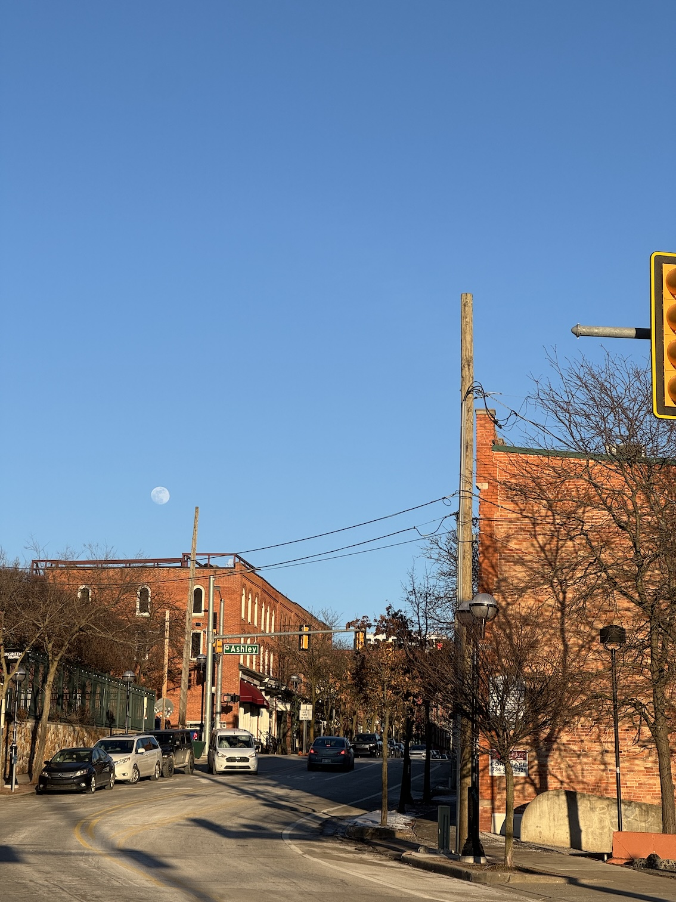
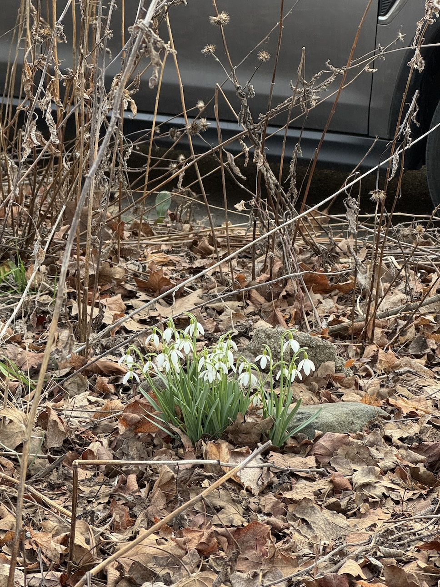
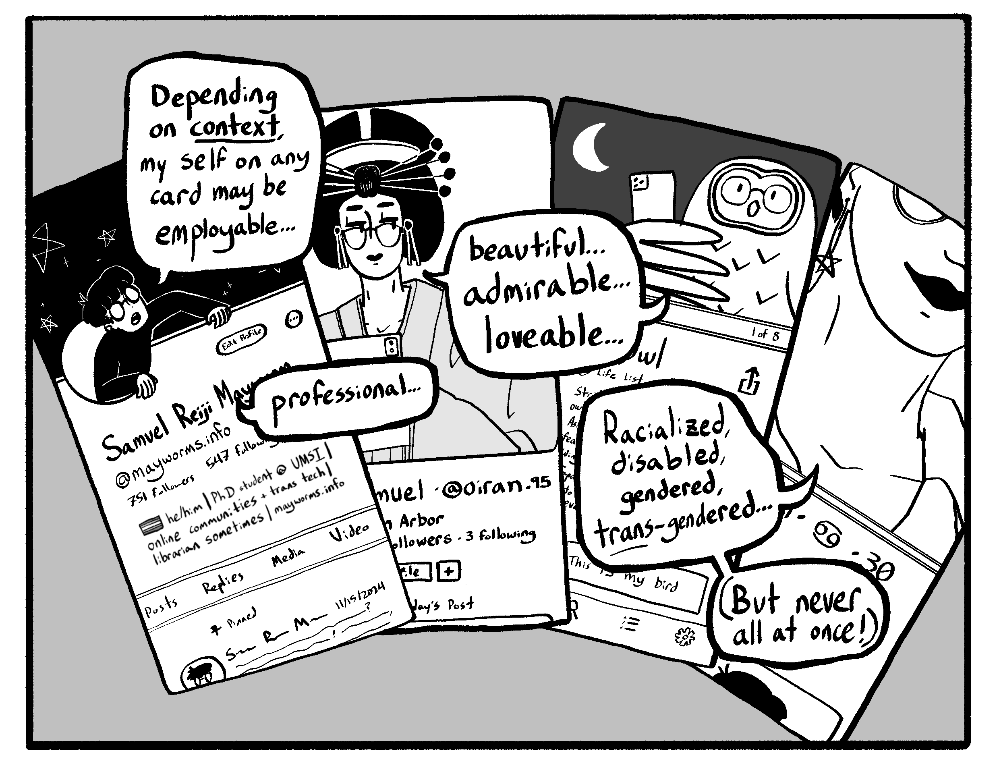
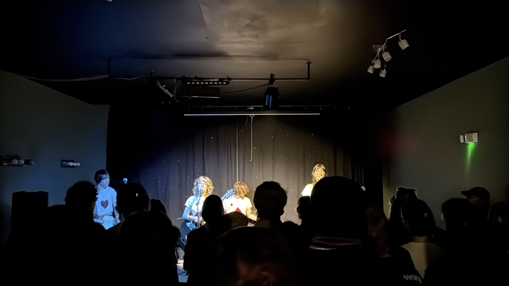
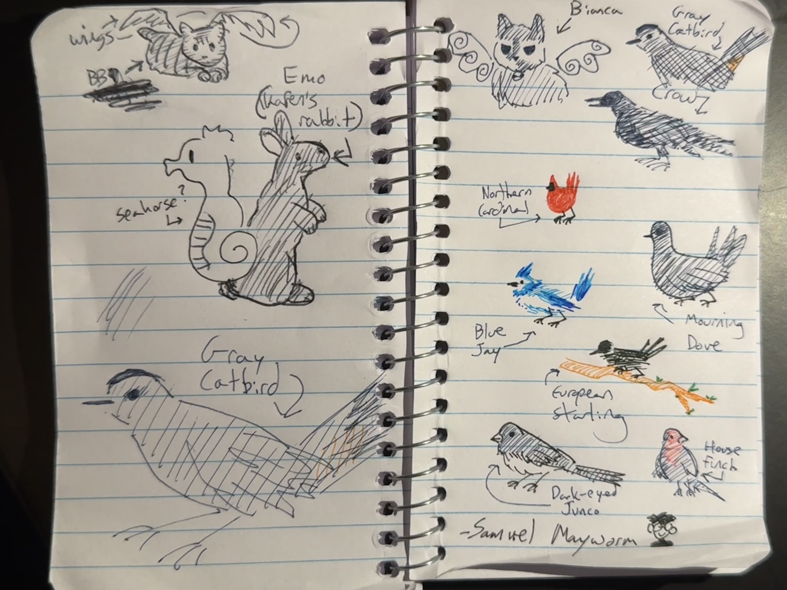

    <figure>
        
    </figure>
    <figure>
        
    </figure>

Hello there! Today is the last day of winter; Ann Arbor is a comfortable 52°F at the moment, and should hit the mid-60s for the first day of spring tomorrow. It will inevitably snow at least once or twice more throughout April... even so, I'm thankful we're through the worst of it ( ◜ᴗ◝ )

### PhD & Research
Happy to announce that I am attending the <a href="https://sites.google.com/view/between-and-beyond/home-page?authuser=0" target="blank"><b>Between and Beyond: Designing for Identity Complexity in HCI</b></a> workshop at <a href="https://chi2026.acm.org" target="_blank"><b>CHI 2026</b></a> this year! Excited to discuss the friction between categorical framings in HCI and the fluid/context-specific/contested nature of identity, the implications of this friction for people whose experiences/identities do not fit cleanly within these categories, and how HCI systems could better support <i>"identity as relational and evolving, rather than as fixed categories."</i> ( ᵕᴗᵕ )

    

I wound up writing a short workshop comic about the difficulty of depicting identity complexity on social media platforms that impose such rigid identity categories on their users. Will share the comic on my website after the conference (and after making a few typesetting revisions!). 

Also very excited to attend CHI 2026 generally -- this will be my first time ever visiting Europe! I've traveled so much more since starting the PhD than I ever have before... deeply grateful for the opportunity, my world has grown a lot as of late! ( ᵔ ᵕ ᵔ )

### Life & Birds 

    <figure>
        
    </figure>
    <figure>
        
    </figure>

I tend to add a little month-long personal recap to each of my blog posts, don't I? This month's post is no different: between karaoke at a dear friend's birthday party (shoutout to the Ann Arbor District Library's loanable speaker system!), watching <i>Survivor: Season 50</i> with pals (I like the old/new gen interplay... but not the celebrity tie-ins!), enjoying <i>Pokémon Go Tour 2026</i>, seeing <a href="https://sleeptighttiger.neocities.org" target="_blank"><b>Sleep Tight Tiger</b></a> live at Dreamland Theatre in Ypsilanti, and playing more <i>Pokémon: Pokopia</i> (shocked by how good it is)... I've had a solid late February through mid-March! 

As for the birds: last weekend, I drove down to Meijer and bought an 8 lb bag of unsalted, in-shell peanuts for the Blue Jays who visit my balcony's bird feeders. The Blue Jays eat more peanuts lately now that the weather's warming up; the 4 lb bag I bought last time only lasted a month and a half, and I'm not sure the 8 lb bag will last much longer! These corvids are eating me out of house and home... but here I am, feeding them all the same. (ᵕ,,—ᴗ—,,)

Robins and European Starlings have been more visible around my apartment since March began. Neither the robins nor starlings show much interest in my bird feeders; I expected this from the robins, but am surprised that the starlings are uninterested in the black oil sunflower seeds! It's nice seeing both hang out in the trees around my area though (even if the starlings are quite noisy, even louder than the blue jays!). I haven't seen the cardinals on the balcony as often lately, probably because they're in nesting season right now... I wonder if they'll show up more often in the summer?

### Website
Minor site: update: officially implemented the FontAwesome plugin! The emoji in the sidebar Contacts list have been replaced with official logos (e.g. Google Scholar, GitHub, etc) and cleaner graphics. My next website priorities are:

- **Fixing single image/gallery view formatting**: easily my biggest struggle right now - lots of image sizing issues on both desktop/mobile atm (including in this blog post!) ( -﹏- ) 
- **Updating website font(s)**
- **Mobile view clean-up generally**

Will try to fix image/gallery view formatting before heading off to CHI 2026 in Barcelona! Lord knows I'll take plenty of photos lol