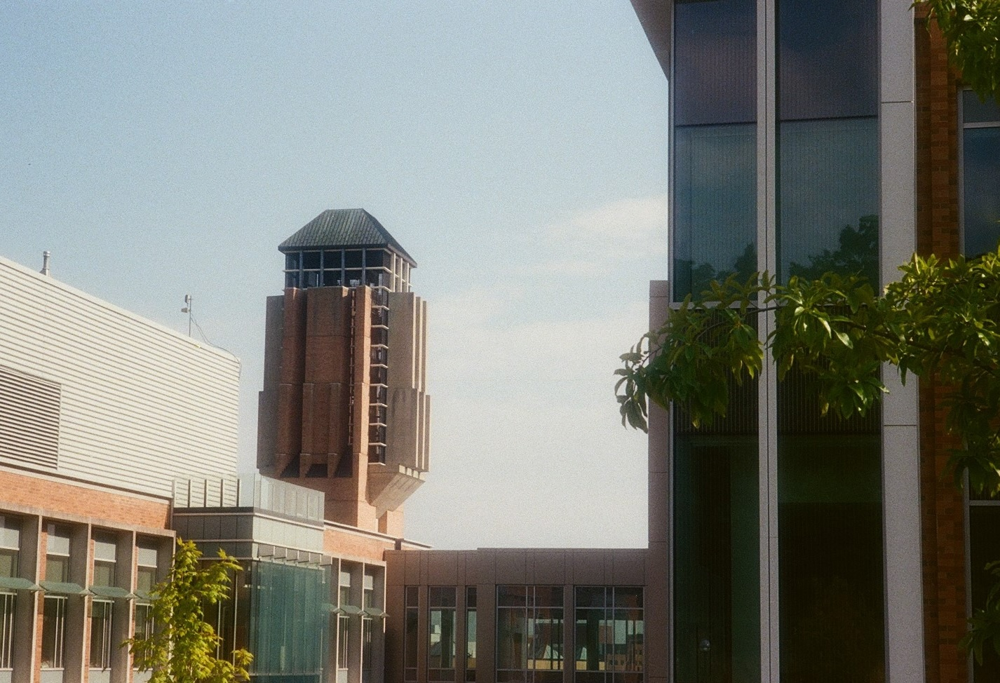
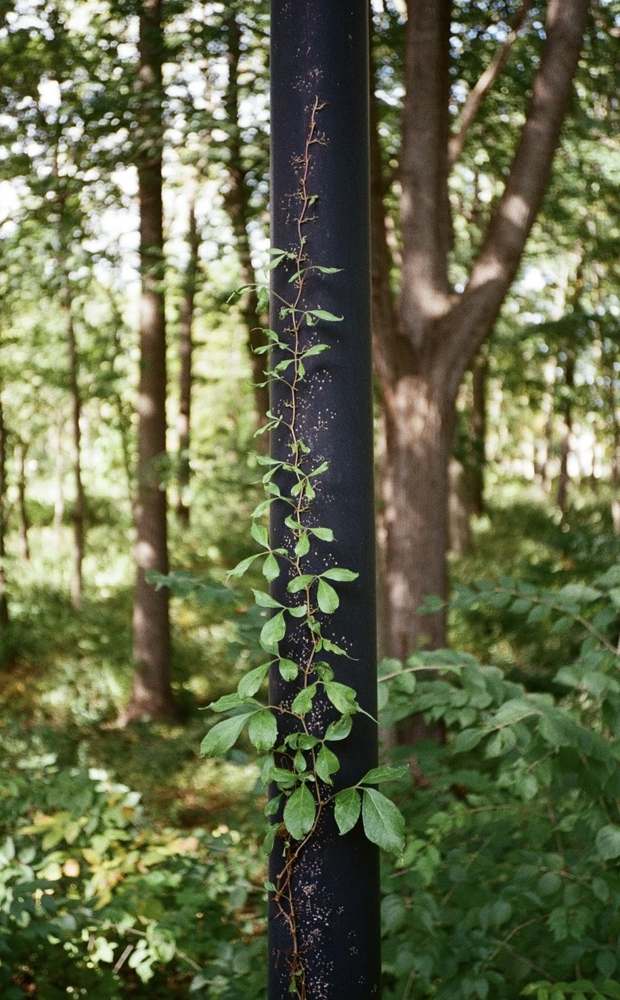
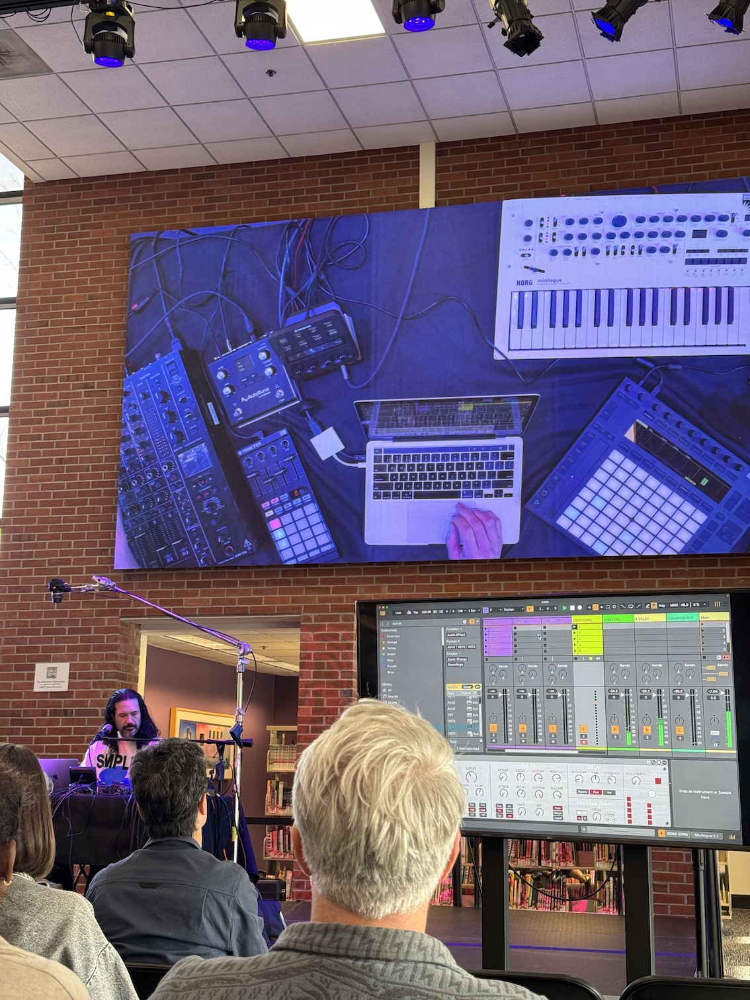
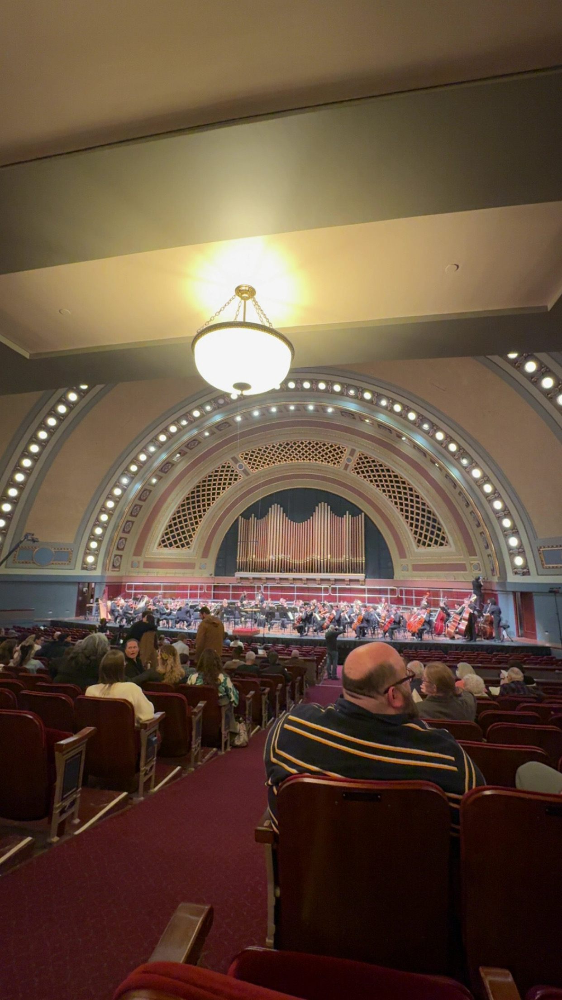
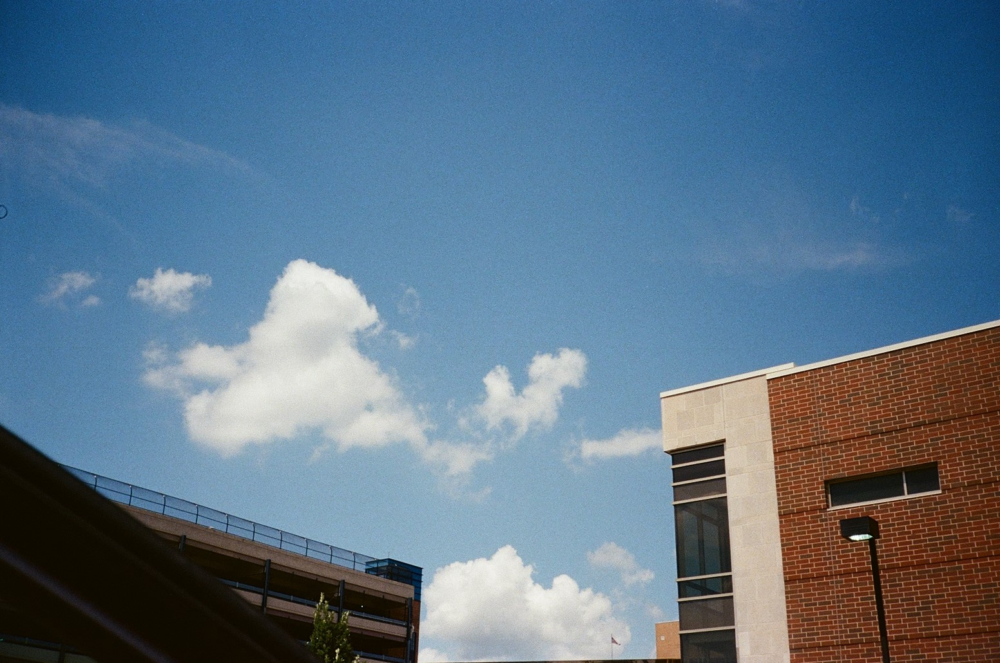
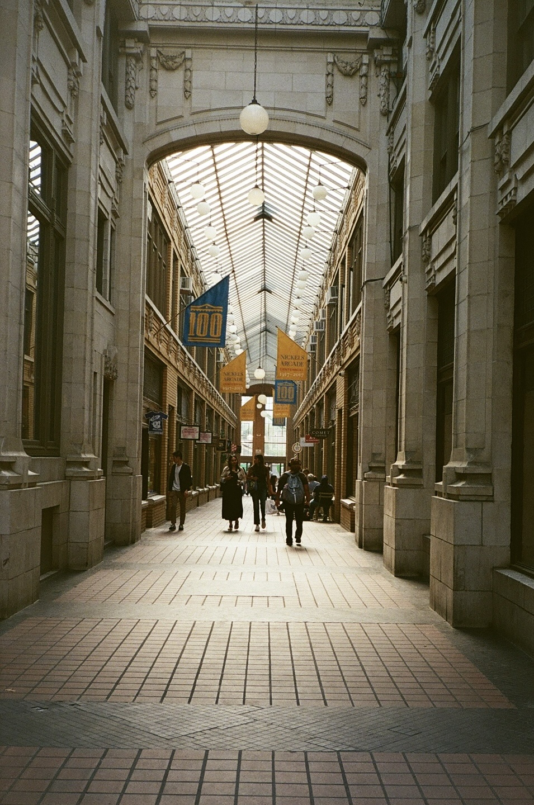
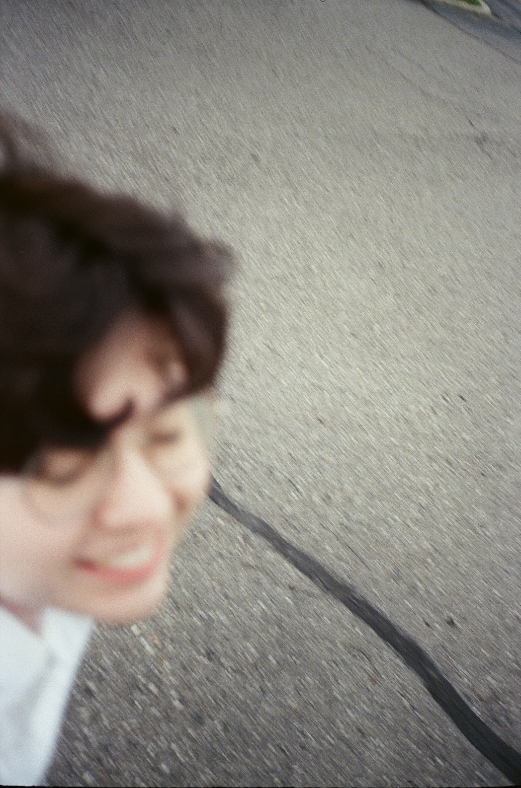
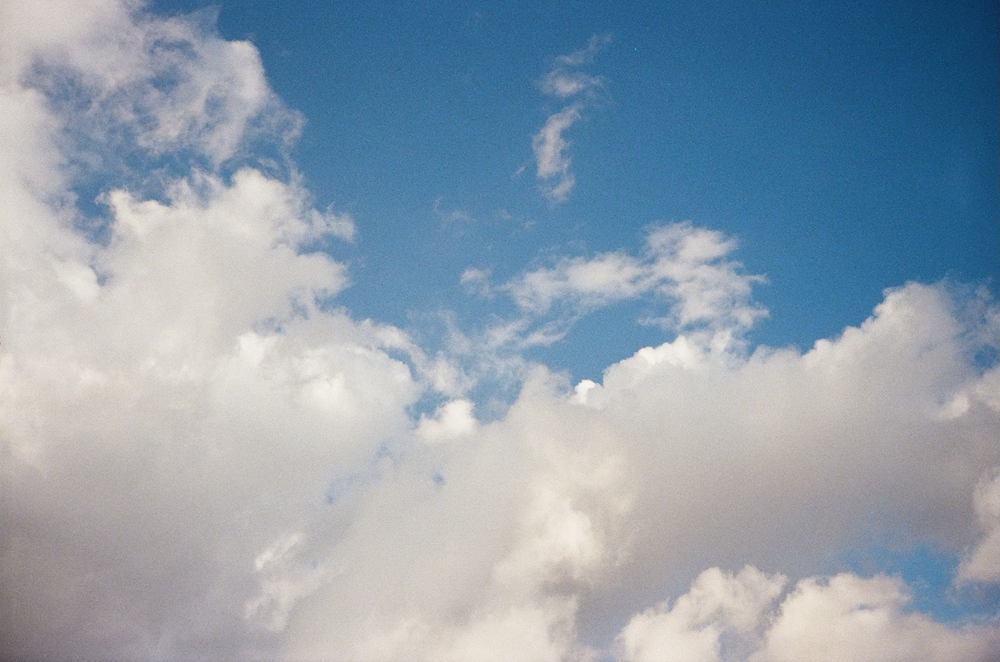

    <figure>
        
    </figure>
    <figure>
        
    </figure>

Hello there! It rained quite hard in Ann Arbor yesterday; I worked in a café yesterday afternoon and had to wait for the weather to calm down before walking back home... 'tis the season, I suppose (ᵕ—ᴗ—)

<b>Side note:</b> today's blog post is shorter than usual! My goal is to <b>write more short-form blog posts</b> instead of just long monthly "recaps." This should make it easier for me to share impromptu updates and ideas (rather than sitting on thoughts for weeks between posts). I will continue writing longer posts as well, but some variety is a good thing ( •‿• )

<b>Side note 2:</b> Debuting two new blog post categories today, <b>"art"</b> and <b>"conferences"</b>! These categories should 1) help me seperate posts about research conferences from posts about research/the PhD program specifically, and 2) make it easier to showcase my creative work down the road.

### Life 

    <figure>
        
    </figure>
    <figure>
        
    </figure>

The second half of March was quite nice! In the past few weeks, I attended poetry readings by <a href="https://yalebooks.yale.edu/book/9780300285062/thrown-voice/" target="_blank"><b>Isabel Neal</b></a> and by <a href="https://www.toosie.art" target="_blank"><b>Daniella Toosie-Watson</b></a> at Literati! I have little poetry background, so listening to poets share their work (and thinking critically about how they are written, what feelings they are meant to invoke, etc) has been a big learning experience for me. Between the Literati poetry readings, my friend's <a href="https://www.mayworms.info/posts/2026-02-23.html#personal-%26-birds" target="_blank">Burns Night party</a>, and other local events... I've been around many poets lately! Ann Arbor is such a uniquely good place to meet and learn from other creatives, I am very thankful for this.

I also saw <a href="https://ghostly.com/artists/matthew-dear" target="_blank"><b>Matthew Dear</b></a> give an Ableton demo at the Ann Arbor District Library (Downtown). I listened to Beams (Dear's 2011 album) quite a bit in high school/undergrad, and was excited for the chance to see him live (completely forgot that he's based in Ann Arbor!). He gave an awesome talk on how he approaches the creative process while producing music, and the importance of "creating like a child" by tapping into ideas before doubting or rejecting them... I will try to remember this going forward!

Outside of that, I also roller skated at a friend's birthday party, watched another friend's choir performance at Hill Auditorium (way to go, Asher!), attended an Ann Arbor Film Festival queer/trans short film contest, and watched <a href="https://letterboxd.com/film/tampopo/" target="_blank"><b><i>Tampopo</i></b></a> at a good friend's place. ...Wow, I've been busy lately! These past few weeks have been very fun, but I should make sure to prioritize rest as well (ᴗ˳ᴗ)ᶻ𝗓𐰁

### Birds
The birds have also been doing well! Though bird feeder activity quieted down in the first two-ish weeks of spring, the songbirds are slowly returning to the balcony as we enter April. Blue Jays are the balcony's most frequent visitors right now... they're eating through my 8lbs bag of peanuts very quickly! My favourite Blue Jay is about 12 inches long from beak to tail, larger than some Northern Flickers (I affectionately call him "Big Boy"). My favourite Northern Cardinal (who I call "Boyfriend;" a particularly rambunctuous cardinal who usually shows up with his paired cardinal, who I call "Girlfriend") also visited yesterday after a several-week hiatus, which made me smile. 

I won't be here to refill the feeders in the week I'm gone for CHI 2026 -- I hope the birds don't get too upset about that!

### Art
I took quite a few film photos with my point & shoot throughout July/August 2025, and finally had my film developed last week. Here are some highlights!

    <figure>
        
    </figure>
    <figure>
        
    </figure>

    <figure>
        
    </figure>
    <figure>
        
    </figure>

I'm still getting the hang of film photography, so taking these photos served as good practice! Excited to take and share more photos in the future ( ◜ᴗ◝ )

### Website
Overhauled the website's image gallery CSS a week or so ago! Image gallery thumbnails should now be properly aligned/sized on both desktop + mobile. My next image gallery CSS goal is to format individual vertical images to look good on desktop (rather than eating up lots of vertical space -- maybe text wrapping could be a solution?). I would also like to adjust image galleries to better support 3+ images (they are currently built to support 2 images, and behave awkwardly when you add more!).

CSS changes can take *lots* of time (mostly spent bouncing between VSCode and W3Schools/MDN documentation lol). I enjoy doing this work though, and feeling my skills develop along the way (•ᴗ•)

(...Wait, wasn't this blog post supposed to be <i>short?</i>)