Hello there! I am back in Ann Arbor after a week-long trip to Barcelona, Spain for <a href="https://chi2026.acm.org" target="_blank"><b>ACM CHI 2026</b></a>! Jet lag thankfully wasn't a big struggle this time around; after a week and a half-ish of returning to work in Ann Arbor, I finally have time to sit and write about the conference ヽ(・ω・)ﾉ

**Note:** these blog entries were mostly written while I was at the conference, then edited after I returned to Ann Arbor; apologies for any past/present tense switches! 

### 11-12 April (Saturday-Sunday // DTW -> ATL -> BCN)    
After arriving at DTW and finding my gate in McNamara, I sat down with my bags... and my glasses broke! A screw fell out from the left lens, and none of the airport shops sold any travel glasses repair kits (╥﹏╥) Thankfully, I was able to put it back in with a pair of tweezers, but that poor stripped screw wasn't meant to last... (more on that later). 

    <figure>
        <a href="../images/04-30-2026-pokemon1.jpg" data-caption="Trading card dispenser (Detroit Metro Airport (DTW), Romulus, MI)">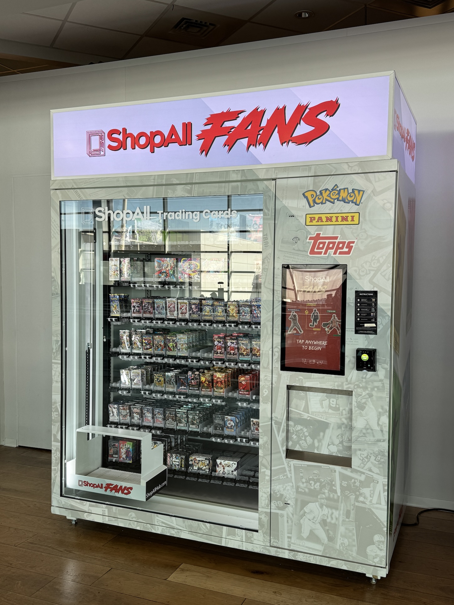</a>
    </figure>
    <figure>
        <a href="../images/04-30-2026-pokemon2.jpg" data-caption="Another trading card dispenser (Hartsfield-Jackson Atlanta International Airport (ATL), Atlanta, GA)">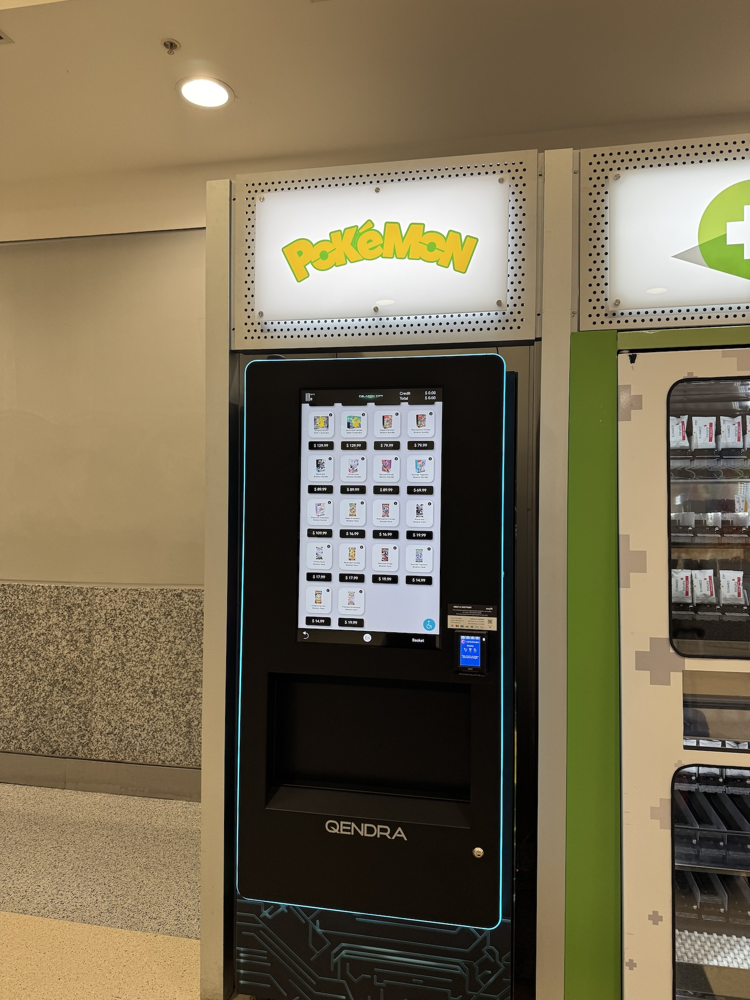</a>
    </figure>

Did you know that DTW has trading card dispensers throughout the airport? You can walk up to any of them and buy some (upcharged) Pokémon card packs, MLB baseball card packs, all kinds of collectables. I knew card collecting became more and more mainstream (for better or for worse) these past few years, but wow... in the airport of all places. (゜-゜)

Decided to grab food after touching down at ATL for my transfer. A woman in line for hot dogs told me a story about seeing Ludacris live back in... 2003? 2004? (<i>"When I was 22 or so!"</i>). The worker behind the counter was so distracted by the story that she mistakenly made me two chili dogs instead of one! Not that I'm complaining LOL 

The flight to Barcelona went fine -- touched down after roughly 8.5 hours, then split a ride to the hotel with some other CHI attendees (who were pretty easy to find -- just look for students carrying poster tubes!). One student in the taxi mentioned reading my past work (<i>"oh, I've cited you before!"</i>), which... wow. There's something so surreal and humbling about knowing other people have read my work and see it as worth building from themselves. It's validating in a way (ᵔ◡ᵔ)

    <figure>
        <a href="../images/04-30-2026-CHI1.jpg" data-caption="Convention center selfie! (Centre de Convencions Internacional de Barcelona, Barcelona, Spain)">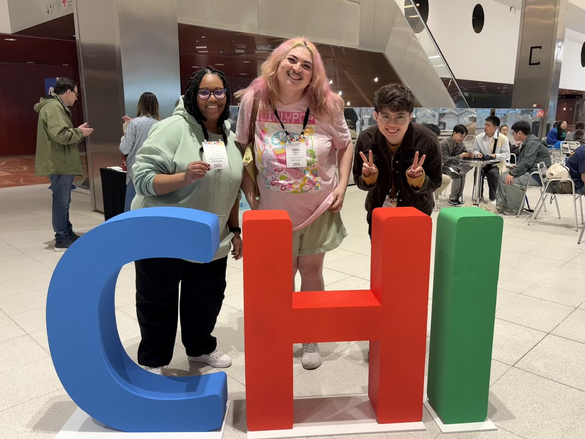</a>
    </figure>

Stopped by the convention center to pick up my registration bags; my friends and I took a few selfies at the venue before grabbing mall food court tapas (very tasty!) for dinner. CHI 2025 took place in Yokohama; I'm half-Japanese and fairly proficient in the language, so getting around on my own was pretty easy. Being in a country where I don't know the language (neither Catalan nor Spanish) is tricky! I wonder how much Catalan/Spanish I'll pick up before I leave?

We trudged back to our hotel rooms after finishing up the tapas; I lied down in my bed and slept for roughly 10 hours. Had to happen. (－－) zzZ

### 13 April (Monday)    
**Day 1 of CHI 2026:** Walked to the convention center with another CHI attendee staying at the same hotel. He mentioned defending his dissertation soon, and his fears about graduating in the current job market (or lack thereof)... yeah. It's bananas out there.  

A few of us tried refilling our water bottles as we walked to the CHI 2026 opening plenary, but the water dispenser would not turn on for some reason. One researcher behind us joked, <i>"how many HCI researchers does it take to turn on a drink dispenser?"</i> Apparently more than three! (ᵕ—ᴗ—)   

    <figure>
        <a href="../images/04-30-2026-CHI2.jpg" data-caption="Opening plenary! (Centre de Convencions Internacional de Barcelona, Barcelona, Spain)">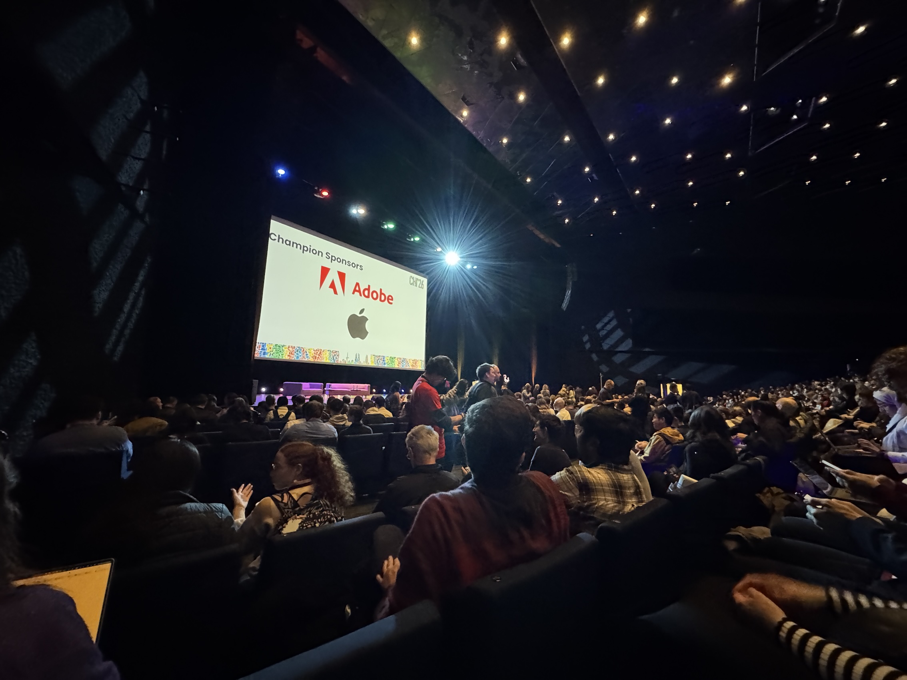</a>
    </figure>
    <figure>
        <a href="../images/04-30-2026-CHI3.jpg" data-caption="UMSI CHI group selfie! Photo by Noor Hindi (Centre de Convencions Internacional de Barcelona, Barcelona, Spain)">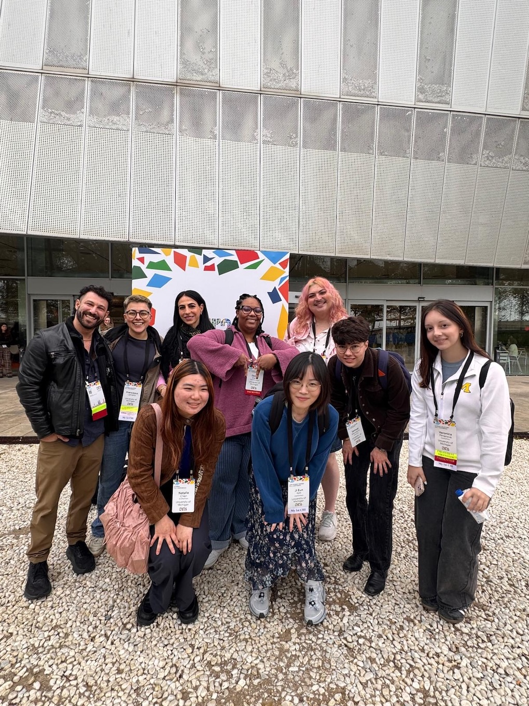</a>
    </figure>

As soon as the opening plenary ended and we finished taking department photos near the big CHI sign outdoors... my glasses broke again! This time the screw landed in the gravel; try as I might, I couldn't find it anywhere. Unsure what to do, I wound up approaching several openly queer conference attendees and asking if they had an emergency sewing kit that I could borrow. By the grace of god, I eventually ran into <a href="https://biglab.co.uk/member/alex-tcherdakoff/" target="_blank"><b>Alex Tcherdakoff</b></a> who had an emergency sewing kit and shared it with me (and some awesome zines, too!) -- a few minutes later, my glasses were in working order (if "hanging by a thread"). Thank you Alex, you're a lifesaver! ദ്ദി´ ˘ `)✧  

It's tempting to slam the gas pedal on the first few days of a conference, attending every cool panel and saying "hi" to as many people as you can before your social battery runs out. I like attending at least a few sessions divorced from my own research area, like <a href="https://programs.sigchi.org/chi/2026/program/session/225006" target="_blank"><b>Identity, Culture, and Games for Social Impact</b></a>. Works like <a href="https://florencesmithnicholls.com" target="_blank"><b>Florence Smith Nicholls'</b></a> <a href="https://dl.acm.org/doi/10.1145/3772318.3791526" target="_blank"><b><i>Video Game Archaeology as Hauntological Practice</i></b></a> make me think about how differently I could be studying online spaces, communities, norms and traditions, organizing... (I didn't have time to ask, but I wonder what changes to in-game commentary Nicholls saw pre/post-Radahn nerf?).  

On another note: a colleague and I chatted at the poster presentation about the disturbing trend among (some) HCI scholars who propose using generative AI "research participants" as a substitute for actual participant interviews, particularly in the case of minoritized communities. <i>"Couldn't genAI help address gaps in research participant diversity?"</i> ...The idea of replacing human voices with genAI approximations disturbs me, especially leaning on its demonstratably biased output related to marginalized populations as a (calfified, approximated, and *not real*) substitute for meaningful conversations with those very communities. Lord. The continued devaluing of people and communities already disenfranchised in our field (and in society generally) repackaged as a novel research methods approach. Come on now.  

### 14 April (Tuesday)
**Day 2 of CHI 2026:** Attended the <a href="https://sites.google.com/view/between-and-beyond/home-page?authuser=0" target="_blank"><b>Between and Beyond: Designing for Identity Complexity in HCI</b></a> workshop today! Met lots of amazing people (shout-out to <a href="https://scholar.google.com/citations?user=ckymaDgAAAAJ&hl=en" target="_blank"><b>Jailyn Zabala</b></a> over at Northeastern!) doing work on identity fluidity/complexity in computing and design; lots of great discussions on pushing back against the identity rigidity embedded in HCI, moving toward design that better supports those of us "in between" more "linear" identities. 

(I haven't finished the minor art tweaks I want to do for my workshop comic yet; once I've wrapped them up, I'll be sure to post it on my website!)

Attended a few different paper sessions this morning; one particular highlight includes <a href="http://jaredleekatzman.com/about.html" target="_blank"><b>Jared Katzman</b></a> presenting <a href="https://dl.acm.org/doi/10.1145/3772318.3790695" target="_blank"><b><i>Designing for Proactive Accountability: Lessons on Governing Technology from Detroit’s Food Sovereignty Movement</i></b></a>. I'm always inspired by work that not encourages working directly with communities, but demonstrates sustaining long-term community relationships *in practice.* Way to go, Jared! ヽ(・∀・)ﾉ   

    <figure>
        <a href="../images/04-30-2026-subway1.jpg" data-caption="Barcelona Metro! (Barcelona, Spain)">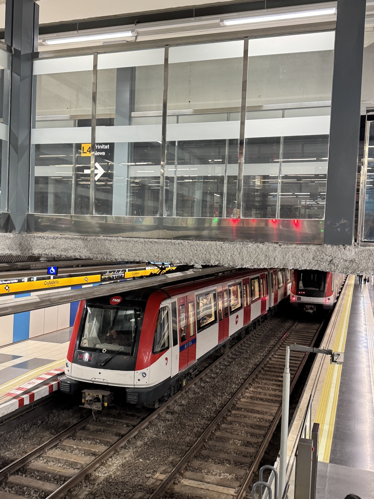</a>
    </figure>

A few of us went to the subway station to grab some transit passes in the evening. I've only heard great things about Barcelona's public transit system, and the subways, above-ground trams, and loanable bike systems all look very exciting... I wonder how it will compare to Yokohama? 

### 15 April 2026 (Wednesday)    
**Day 3 of CHI 2026:** Woke up to several urgent texts from a dear friend about... a suspected tornado that tore through Ann Arbor's west side, including my neighborhood! Imagine my shock when I saw the video footage; lots of damage throughout Westgate and the Old West Side, though thankfully no fatalities. My apartment building was okay, but ultimately lost power for quite some time... not excited to check my fridge once I'm home! ＼(º □ º l|l)/

Sat down and had breakfast at the CHI convention center lobby. A student from Cornell sat down next to me, and we began commiserating about the PhD struggle(s), the frustration of having to work while attending a conference (tell me about it lol), and dealing with nerves while approaching more senior scholars to talk about your work. That last part's gotten easier for me over the past few years; approaching new people at CSCW 2024 felt terrifying, but is much more intuitive to me today. Is that personal growth?

    <figure>
        <a href="../images/04-30-2026-barcelona2.jpg" data-caption="Barcelona Fira Montjuic Hall of Conferences (Barcelona, Spain)">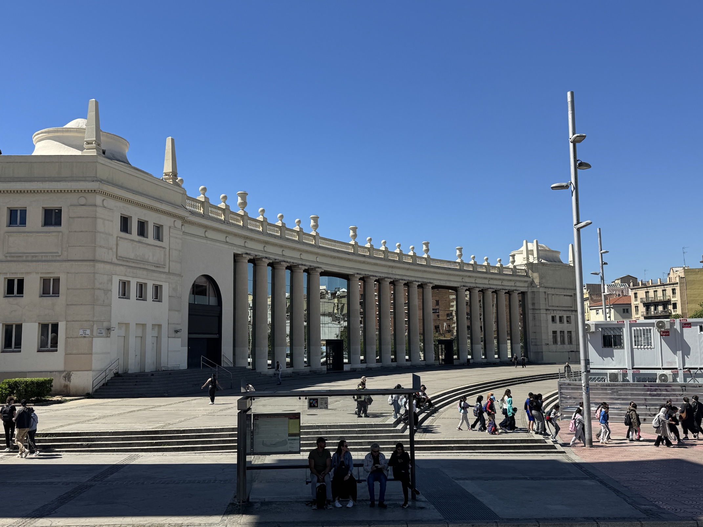</a>
    </figure>
    <figure>
        <a href="../images/04-30-2026-barcelona1.jpg" data-caption="Sagrada Família! (Barcelona, Spain)">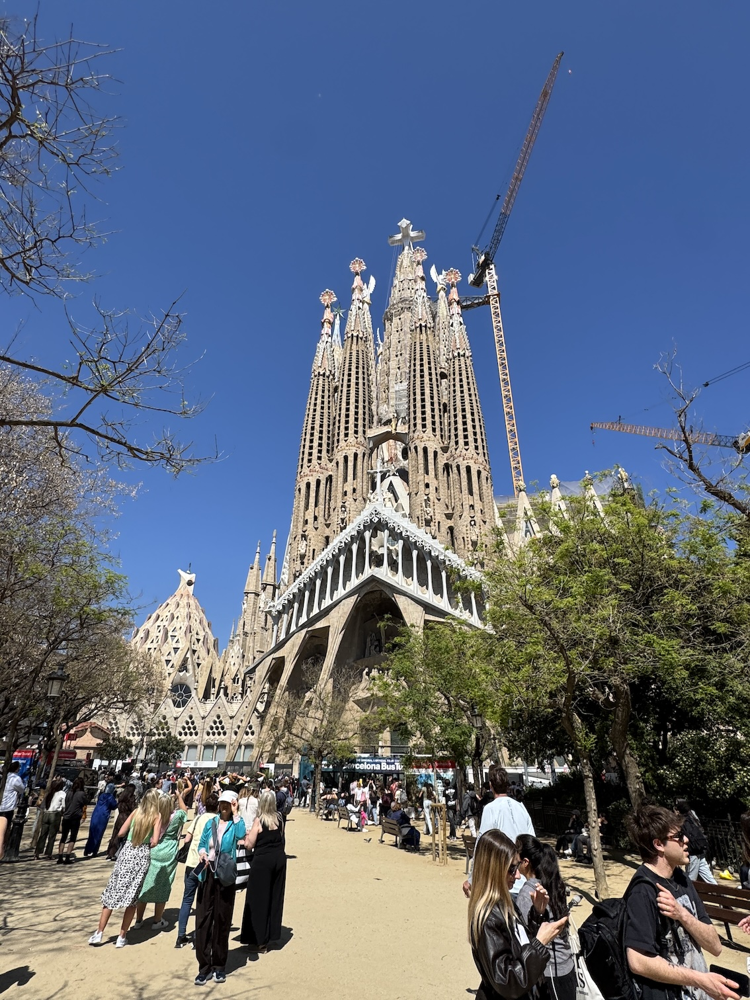</a>
    </figure>

Took the afternoon off to tour the city and visit Sagrada Família with Hibby and Denny. It's cool how many different motifs and architectural styles are visible on the same structure (by design!). My camera's film roll ran out partway through; will remember to bring extra next time! 

I also volunteered to take photos at this year's <a href="https://medium.com/sigchi/2026-acm-sigchi-awards-and-special-recognitions-d942983d9228" target="_blank">SIGCHI Awards</a> ceremony! It felt surreal being surrounded by people who have been in my field for decades and decades... will that be me one day? How will I feel on the other side of things? What will academia look like at that point? How will I feel about my current struggles (like struggling through my pre-cand milestone, or my current anxieties about academia in the United States) -- will I frown? Will I look back and laugh?

Nice walk back to the hotel tonight. I'm getting better at being around lots of people; I also need a little time alone. Don't we all?

(My one regret about today is that I was unable to attend <a href="https://www.ghadeerawwad.org/en/" target="_blank"><b>Ghadeer Awwad's</b></a> presentation on <a href="https://dl.acm.org/doi/full/10.1145/3772318.3790363" target="_blank"><b>Digital Infrastructural Resistance: Working Around Severe Telecommunication Disruptions in Gaza</b></a> -- excited to ask her more about her presentation!)

### 16 April 2026 (Thursday)   
**Day 4 of CHI 2026:** Sure enough, the National Weather Service (NWS) confirmed that an EF-1 tornado ripped through Ann Arbor's west side last night. One of my friends was unable to leave his apartment/head to work the morning after because multiple trees fell and blocked both driveway exits... ugh. First tornado to hit the city since the '80s! (╥﹏╥)   

    <figure>
        <a href="../images/04-30-2026-CHI5.jpg" data-caption="Hibby Thach presenting at CHI (Barcelona, Spain)">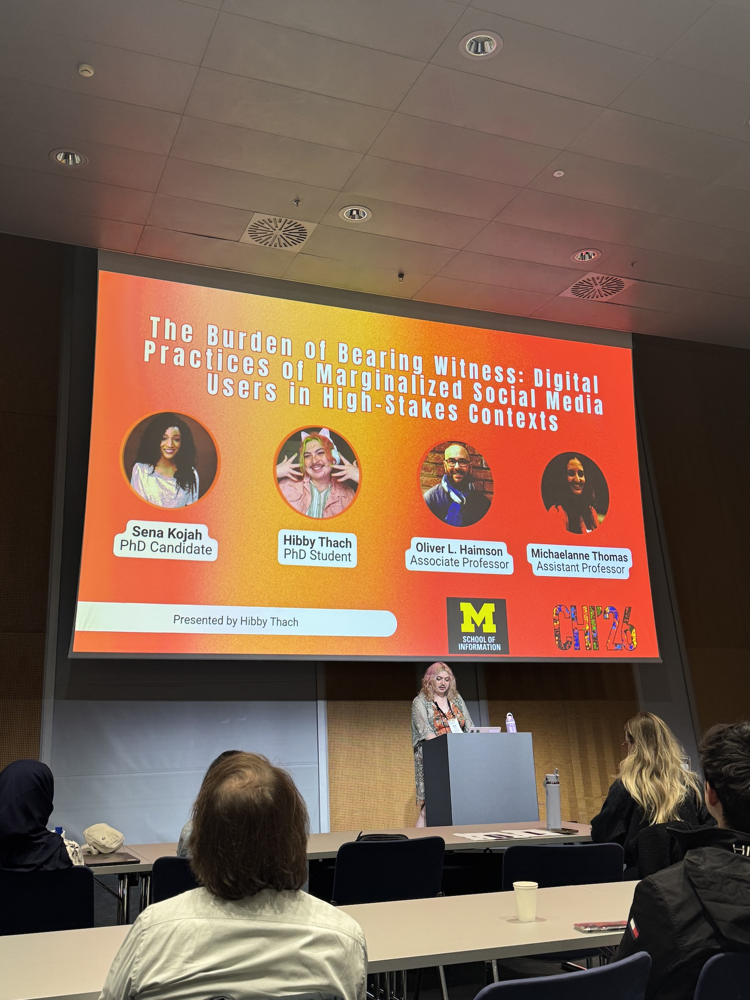</a>
    </figure>
    <figure>
        <a href="../images/04-30-2026-CHI4.jpg" data-caption="Hibby Thach presenting at CHI (2!) (Barcelona, Spain)">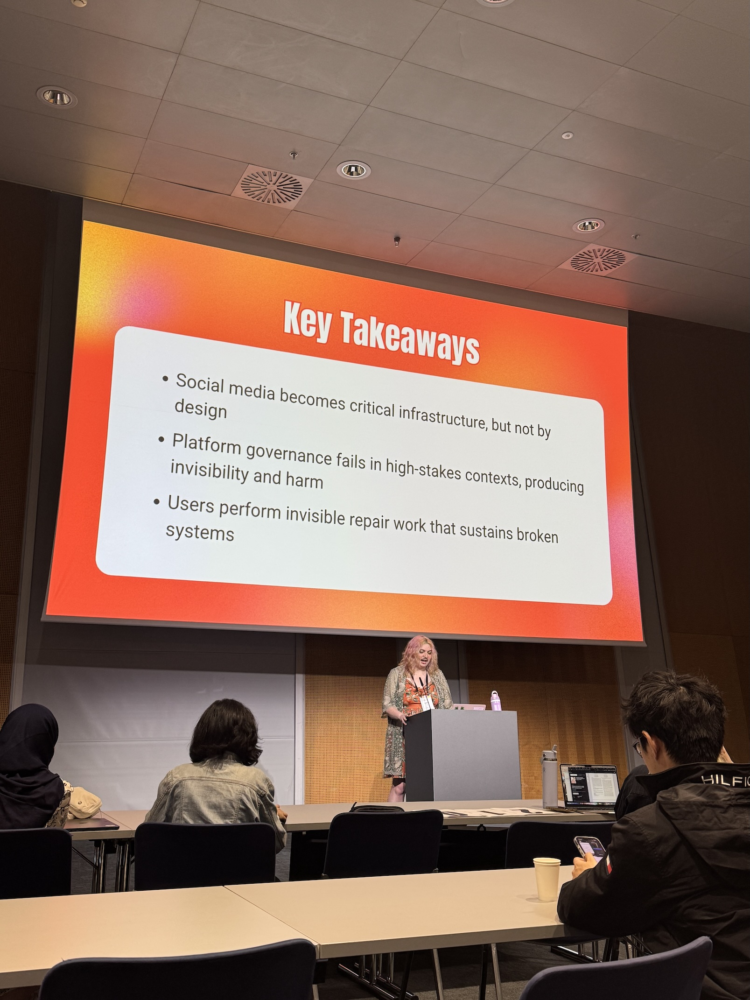</a>
    </figure>

Watched <a href="https://www.hibbythach.com" target="_blank"><b>Hibby Thach</b></a> present <a href="https://dl.acm.org/doi/full/10.1145/3772318.3791924" target="_blank"><b><i>The Burden of Bearing Witness: Digital Practices of Marginalized Social Media Users in High-Stakes Contexts</i></b></a> (first-authored by <a href="https://www.si.umich.edu/people/sena-kojah" target="_blank"><b>Senami A. Kojah</b></a>) this morning at the <b>Labour, Data, and Ethics</b> paper session -- great job, Hibby! Thinking a lot about how to connect my work (focused on trans/nonbinary communities) with broader conversations on marginality in HCI, technology, online infrastructures... this paper may give a few pointers on that.

Finished as much work as I could while attending this year's <a href="https://dl.acm.org/doi/10.1145/3772363.3778787" target="_blank"><b>CHI Stitch 'n B*tch, A Feminist HCI Meetup</b></a>; way more attendees showed up than could fit in the room, so we wound up working in the hallways, the outdoor patio, anywhere we could fit really. Despite the crowds, I think it's a good thing that so many people wanted to attend lol. 

    <figure>
        <a href="../images/04-30-2026-queernight1.jpg" data-caption="Queer night! (Candy Darling, Barcelona, Spain)">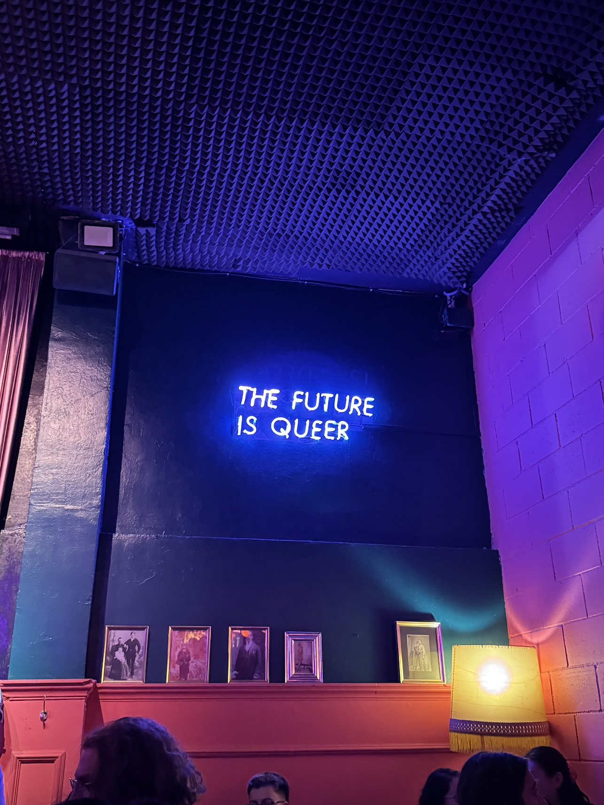</a>
    </figure>
    <figure>
        <a href="../images/04-30-2026-queernight2.jpg" data-caption="Cute dog I saw on my way home (Barcelona, Spain)">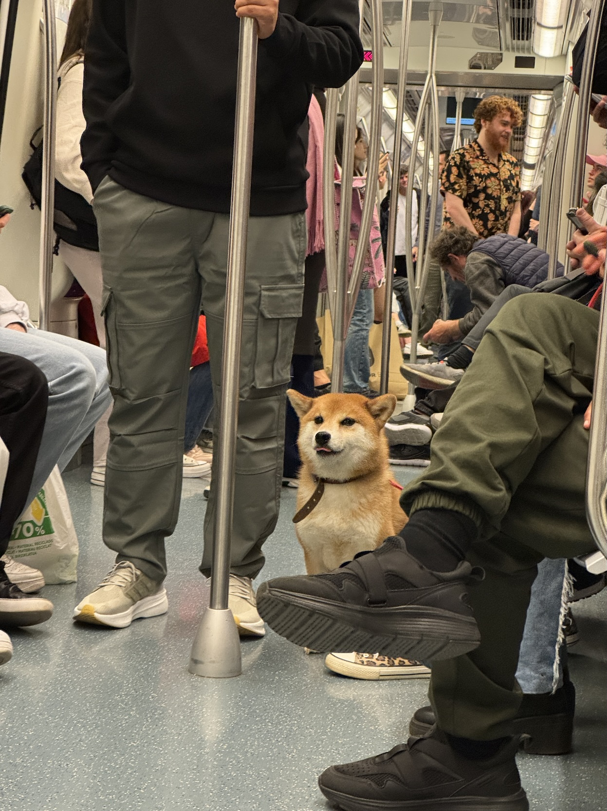</a>
    </figure>

The most common question I heard at the get-together was: *"are you going to the queer get-together tonight?"* I took the subway down to <a href="https://www.timeout.com/barcelona/lgbtq/candy-darling" target="_blank">Candy Darling</a> for the get-together that night, and had a wonderful time! Between the transness, queerness, autism, and all the other less-easily-labeled things, it's not every day I can sit down in any given academic space and *not* feel like an odd one out! Yet there we were, a bunch of goofball students sitting on the ground in our self-appointed "Autism Zone" (Candy Darling ran out of chairs lol), commiserating about being overstimulated, but also having fun, and also knowing that academia in the United States is falling apart (for queer/trans people and just generally), and also feeling thankful just to be here. (｡• ᵕ •｡)   

If only I could have stayed longer, but I had to wake up early to attend a few more paper presentations the next day. Still, I'm so glad I went -- my heart felt full as I traveled back to the hotel. 

### 17 April 2026 (Friday)    
**Day 5 of CHI 2026:** And just like that, CHI came to a close... funny how quickly that happens. 

    <figure>
        <a href="../images/04-30-2026-CHI6.jpg" data-caption="Denny Starks presenting at CHI (Barcelona, Spain)">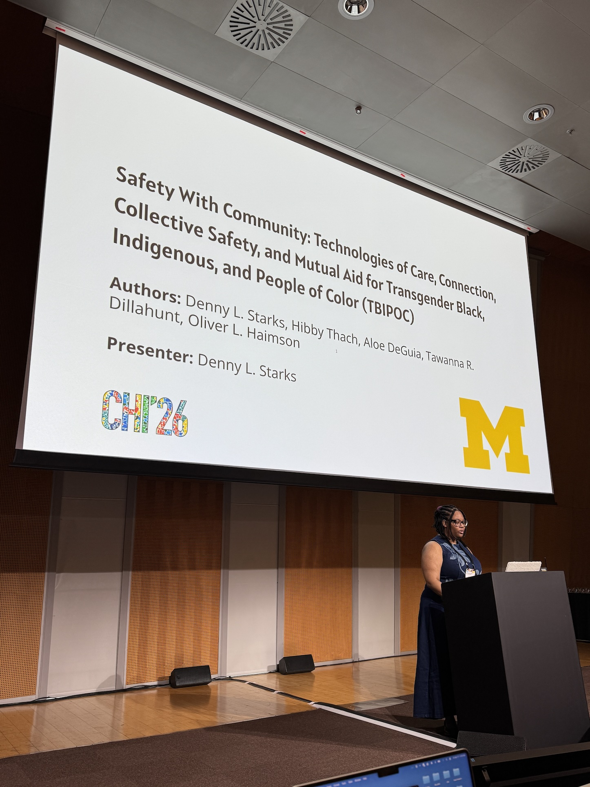</a>
    </figure>
    <figure>
        <a href="../images/04-30-2026-CHI7.jpg" data-caption="Denny Starks presenting at CHI (2!) (Barcelona, Spain)">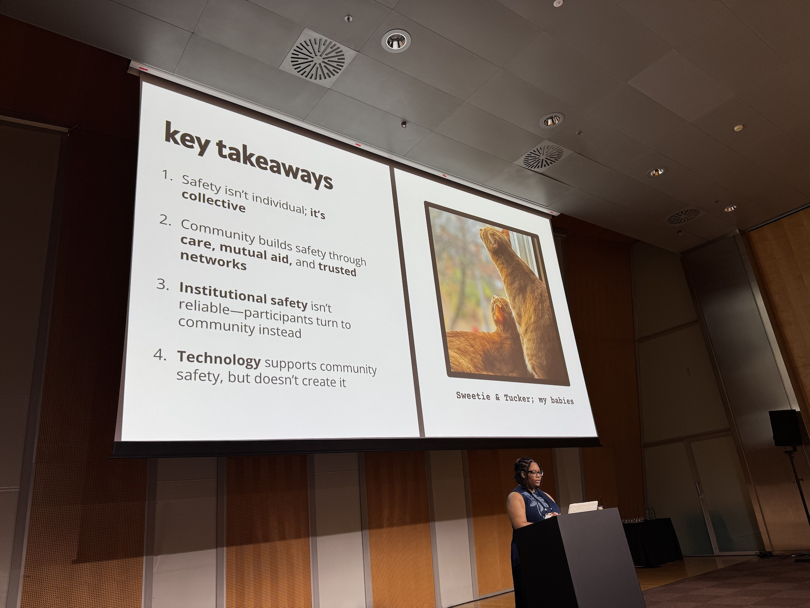</a>
    </figure>

    <figure>
        <a href="../images/04-30-2026-CHI8.jpg" data-caption="Denny Starks presenting at CHI (3!) (Barcelona, Spain)">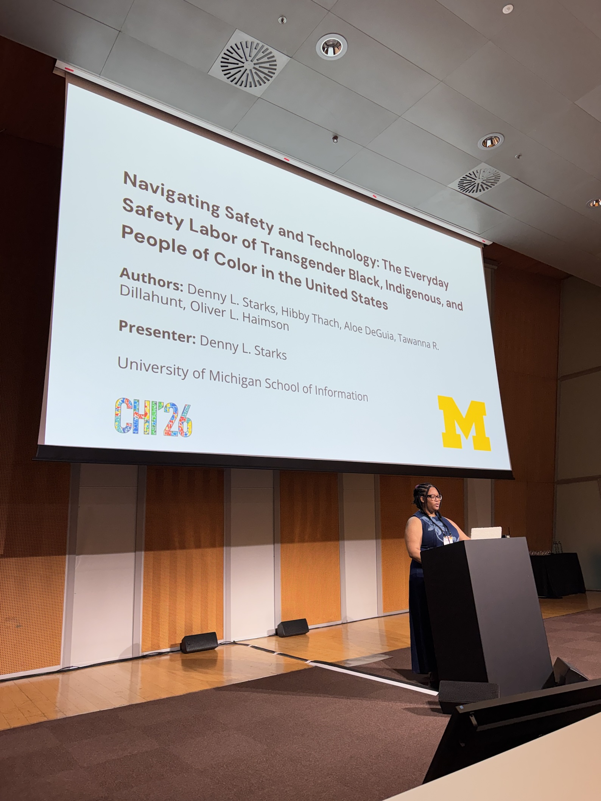</a>
    </figure>
    <figure>
        <a href="../images/04-30-2026-CHI9.jpg" data-caption="Denny Starks presenting at CHI (...4!) (Barcelona, Spain)">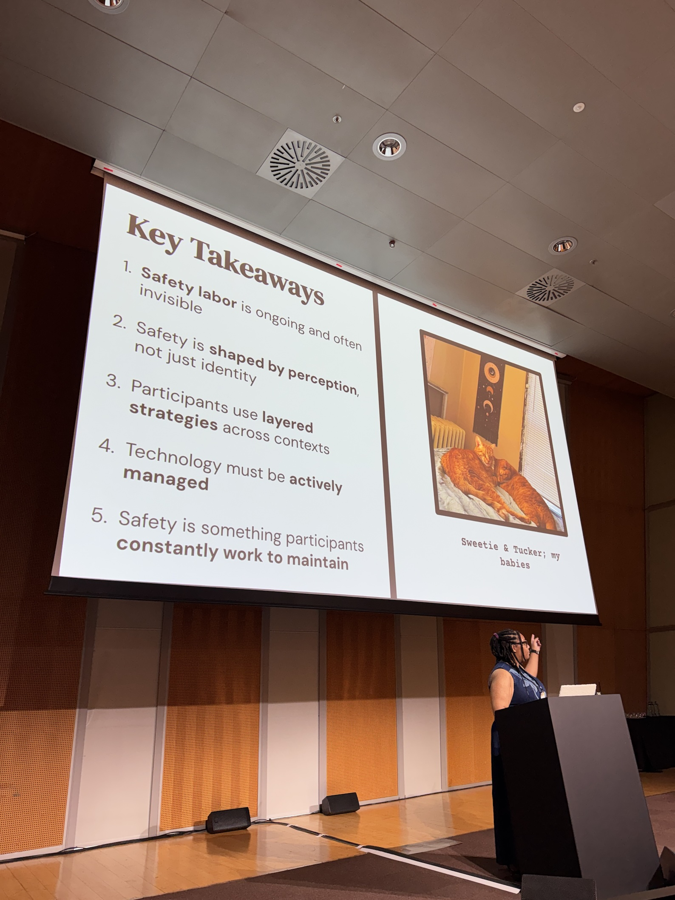</a>
    </figure>

My friend <a href="https://www.si.umich.edu/people/denny-starks" target="_blank"><b>Denny Starks</b></a> gave their first (two!!) presentations this morning, <a href="https://dl.acm.org/doi/10.1145/3772318.3791842" target="_blank"><b><i>Safety With Community: Technologies of Care, Connection, Collective Safety, and Mutual Aid for Transgender Black, Indigenous, and People of Color (TBIPOC)</i></b></a> and <a href="https://dl.acm.org/doi/10.1145/3772318.3791838" target="_blank"><b><i>Navigating Safety and Technology: The Everyday Safety Labor of Transgender Black, Indigenous, and People of Color in the United States</i></b></a>. Both of their talks went wonderfully -- so proud of you, Denny!!

    <figure>
        <a href="../images/04-30-2026-barcelona3.jpg" data-caption="Barcelona Cathedral (Barcelona, Spain)">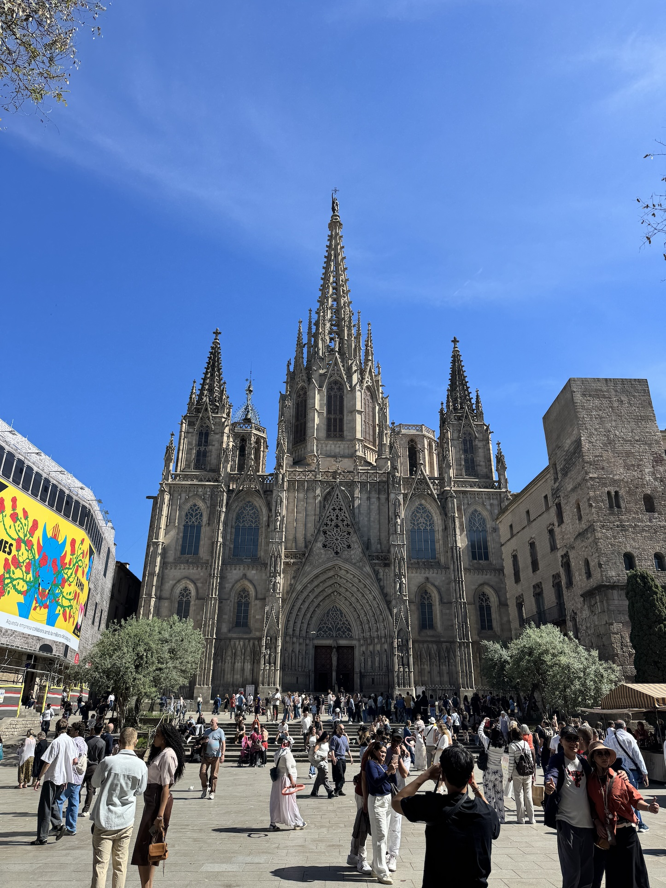</a>
    </figure>
    <figure>
        <a href="../images/04-30-2026-barcelona4.jpg" data-caption="Arc de Triomf (Barcelona, Spain)">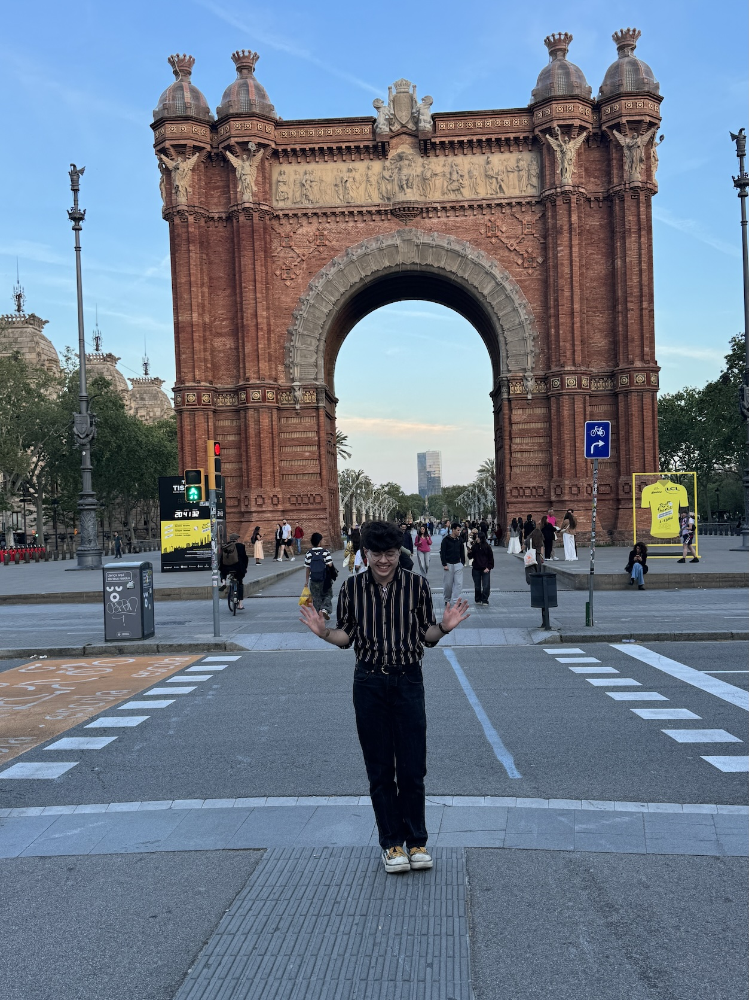</a>
    </figure>

After Denny's presentations wrapped up, a few of us got together and explored the Old Gothic Quarter for a little while. What a beautiful, beautiful architectural area... every 30 seconds you turn your head and see the most beautiful cathedral, statue, random apartment balcony you've seen in your entire life. (Not just good for sightseeing, but also for Pokémon Go!).

My friend <a href="https://www.linkedin.com/in/costa-rita/" target="_blank"><b>Rita Costa</b></a> joined us on our sightseeing trip (I always seem to hang out with her on the final day of CHI lol); we talked about Barcelona's more-walkable street design/efficient public transit options compared to most American cities, and how frustrating it might be to adjust to highway-centric design once I return to Metro Detroit. The final day of CHI 2025 in Yokohama last year made me dwell on similar things... wherever I end up in the long-term, I hope it's somewhere that doesn't require a car by default. 

We parted ways after having gelato and taking photos by Barcelona's <a href="https://en.wikipedia.org/wiki/Arc_de_Triomf" target="_blank">Arc de Triomf</a>... I do hope to visit again some day. (*^‿^*)

### 18 April 2026 (Saturday // BCN -> AMS -> DTW)    

    <figure>
        <a href="../images/04-30-2026-klm1.jpg" data-caption="So long, Barcelona! (Barcelona, Spain)">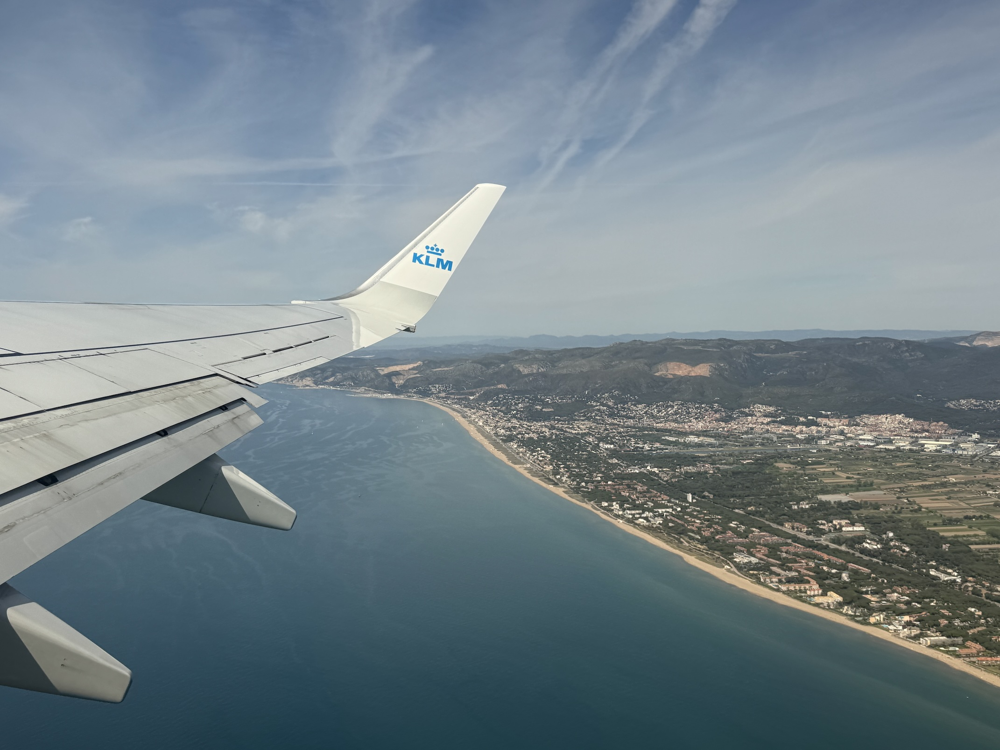</a>
    </figure>

The trip home was chaotic (note to self: the "minimum 2 hour layover" rule exists for a reason), but we ultimately made it home in one piece. There was still some tornado debris (mostly tree branches) scattered around my neighborhood, but at least our power was back. 

I ended my trip exactly how I did last year: taking a shower, having a cheeseburger for dinner, then going to sleep. As is tradition. (－ω－) zzZ  