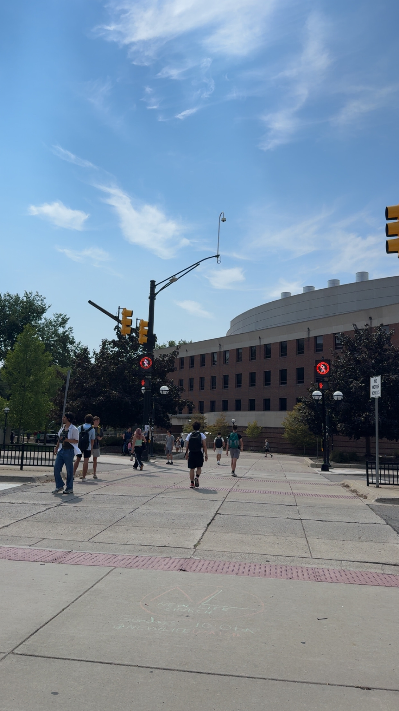
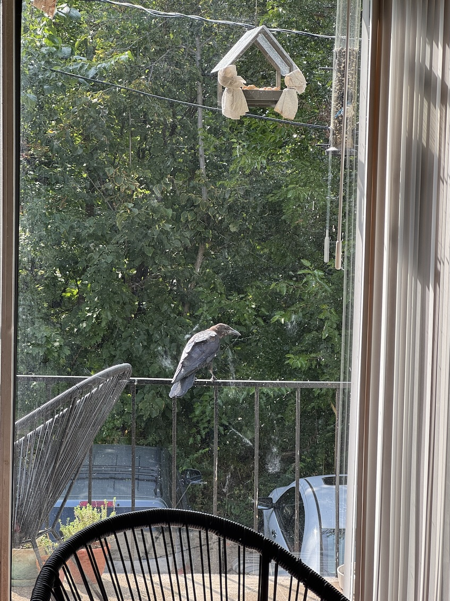

    <figure>
        
    </figure>
    <figure>
        
    </figure>

Holy smokes, it's been a while! Apologies for the radio silence; between research, PhD milestones, and personal life, I had little time this summer to update my blog!

What was I up to this summer? I'll break it down between a few different posts. This post will focus on PhD, research, publications, and conference-related updates ദ്ദി ( ᵔ ᗜ ᵔ )

### PhD & Research    
Big news: after successfully defending my Field Prelim last Friday, I am now officially a PhD candidate! ꉂ(˵˃ ᗜ ˂˵) My field prelim paper (essentially a large literature review) focused on areas related to STS/infrastructuring, technologically-mediated care work (particularly technological trans care), and online communities as sites for care. STS is a very new world for me, and I really appreciated jumping into a whole new world (to me) of infrastructuring literature this summer. I wonder how the rest of the PhD program will feel now that I'm a candidate? 

Another project I worked on all summer is... a <a href="https://chi2027.acm.org" target="_blank">CHI 2027</a> submission! Which I can't really describe in detail while it undergoes anonymous review (ᵕ—ᴗ—) Preparing a draft for submission is always stressful, especially as you approach the deadline, start over-thinking last-minute revisions, double-triple-quadruple-check all your metadata... but it's in! Will share more on this paper once I finally can lol

This Fall is also my first-ever semester as a graduate student instructor (GSI)! The undergraduate class I'm helping instruct is a project-oriented course on online communities. One thing I'm quickly learning is how important improvisational skills are to teaching... many sudden challenges, changes to plans and timelines, etc, that you can only truly handle if you're quick on your feet. As a creature of routine, <i>"going with the flow"</i> is a little hard for me -- but I will work to develop these skills, and become better-prepared to instruct along the way (˶ᵔ ᵕ ᵔ˶)

### Publications     
Two book chapters I co-authored this summer will be published in <a href="https://b1narypress.com/dispatches-trans" target="blank"><b>Dispatches from the Trans Internet</b></a>, a forthcoming book edited by Eliot Dunn and published by <a href="https://b1narypress.com" target="_blank">B1NARY PRESS</a>:
- <b>Queer Roots to Queer Capitalism: Transgender People of Color's Experiences on Lex in the U.S. Midwest</b>, by Forum Modi, <b>Samuel Reiji Mayworm</b>, Mel Monier, Oliver L. Haimson, Austin Toombs <i>(in press)</i>    
- <b>Hostile Digital Archives: Resisting, Refusing, and Reapproaching the Trans Digital Record</b>, by Kat Brewster, <b>Samuel Reiji Mayworm</b>, Oliver L. Haimson <i>(in press)</i>    

I'm so, so excited about both of these book chapters, about the Dispatches from the Trans Internet inaugural issue, and about the brand-new B1NARY PRESS! Happy to see another space for critical transfeminist tech research in the world ◝(ᵔᗜᵔ)◜ 

### Conferences    
Michaelanne Thomas and I are presenting at a <a href="https://www.4sonline.org/about_the_conference_toronto.php" target="_blank"><b>4S</b></a> panel this year! The panel is titled <i>Reworking TechnoPower: Everyday Digital Practices
in Marginalized Worlds</i>. We are presenting <i><b>Digital Care and Survival: Contesting Platform Rigidity, Online Exclusion, and TechnoPower among Trans BIPOC Communities</i></b>. There will be more to share on this panel in early/mid October (once we're in Toronto for the conference). Watch this space... ( ◕ ᴗ⁠ ◕ )